```{r setup, include=FALSE}

knitr::opts_chunk$set(echo = FALSE, warning = FALSE, message = FALSE, fig.align = "left")

library(tidyverse)
library(sf)
library(gt)

source("@_Region file.R")
Period <- "2010-2019"

table_nums <- captioner::captioner(prefix = "Table ")

table.ref <- function(x) stringr::str_extract(table_nums(x), "[^:]*")

model <- StrathE2E2::e2e_read(implementation, Period, models.path="Files") # Load implementation

Area <- read.csv(str_glue("Files/{implementation}/{Period}/Param/event_timing_SBS.csv")) %>% 
  filter(str_detect(Description, "km2")) %>% 
  .$Value                                                     # Get size of the model domain

Area
```

# Introduction {-}

This document describes the configuration of StrathE2E2 for the South Brazilian Shelf (SBS) and its parameterisation to enable stationary state fitting for both the baseline period (2010-2019) and future projections (2020-2070). These represent contrasting periods of environmental conditions.

Volumetric and seabed habitat data define the physical configuration of the system.
We regard these as being fixed in time.
Similarly, we regard the physiological parameters of the ecology model as being fixed in time.
Some of these are set from external data.
The remainder are fitted, as detailed here.
Changes in the model performance between the different time periods therefore stem from the hydrodynamic, hydro-chemical and fishery driving data.
These are detailed in the ecological drivers and fishing fleet sections.

In the StrathE2E model all marine lifeforms are explicitly or implicitly accounted for, but aggregated into coarse groups or 'guilds' defined mainly by feeding characteristics and diet preferences (Figure \@ref(fig:guilds).
All state variables, except macrophytes, are expressed solely in terms of nitrogen mass.
For more information about the StrathE2E model check the [documentations](http://www.marineresourcemodelling.maths.strath.ac.uk/strathe2e/) available.

```{r guilds, echo=FALSE, fig.cap="Ecological guilds of the StrathE2E model (Heath, 2021)", out.width = '100%'}
knitr::include_graphics("img/guilds.png")
```

> Department of Mathematics and Statistics, University of Strathclyde, Glasgow, UK, E-mail: [m.heath\@strath.ac.uk](mailto:m.heath@strath.ac.uk){.email}
>
> Oceanographic Institute, University of Sao Paulo, Brazil, E-mail: [juliapetroski\@usp.br](mailto:juliapetroski@usp.br){.email}
>
> The code written to support this parameterisation is available on [github](https://github.com/Jack-H-Laverick/MA.BrazilianShelf).

<br>

# Model Domain {-}

The South Brazilian Shelf is a Large Marine Ecosystem (LME) that extends along the Brazilian Exclusive Economic Zone, bounded to the north by Cabo Frio-RJ (22º15’S), and to the south by Chuí-RS (34ºS). The SBS is naturally defined by its geographic, oceanographic, and biological features and supports significant fisheries, making it an ideal region for ecosystem modelling.

The model splits the domain into three zones, inshore/shallow, offshore/shallow, and offshore/deep (Figure \@ref(fig:overhang)).

```{r overhang, echo=FALSE, fig.cap="The spatial structure of StrathE2E; Ocean volumes and seafloor habitats. StrathE2E is built around a simplified spatial structure which represents shelf seas. These spatial units are connected to each other and to boundaries as shown to the right. The volumes connected to each spatial component are highlighted in blue.", out.width = '100%'}
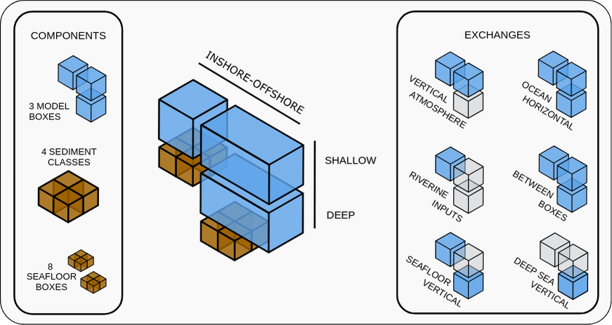
```

The inshore/shallow zone covers waters shallower than `r SDepth` m or `r Distance` km from shore. The offshore zone covers the remaining area of the model domain (Figure \@ref(fig:habitats)). The offshore zone is divided further into a shallow and deep layer. The shallow layer represents water from the surface to `r SDepth` m depth, and shares a boundary with the inshore shallow zone. The offshore/deep zone covers the same area as the offshore/shallow zone, but represents water between `r SDepth` m and `r DDepth` m deep.
There is a second internal boundary between the two offshore zones.

The seafloor of the model domain is represented by 8 habitat types. There are three sediment classes - fine (muddy, 1), medium (sandy, 2) and coarse (gravel, 3). The fourth class (rock, 0) represents an absence of soft sediment and has different geochemical properties. These sediment classes are defined in both the inshore/shallow and offshore/deep zones, yielding 8 habitats (Figure \@ref(fig:habitats)). 
As of V.4, StrathE2E2 can represent an offshore "overhang" where open ocean does not contact the seafloor (Figure \@ref(fig:overhang)).
We utilise this for the SBS implementation to include the fishing fleets just past the shelf edge and represent deepsea interactions.

The perimeter of the model domain is defined by a `r ODepth` m depth contour and the Brazilian coastline. Open ocean boundaries occur wherever there is no coastline. In consultation with local collaborators, we imposed additional boundaries to limit the eastward extent of the model domain at 42.2ºW and Southward along 33.75ºS, 54.35ºW to 36ºS, 50ºW. This coincides with changes in the pattern of fishing effort according to Global Fishing Watch, and with the South Brazil Shelf LME. 

```{r habitats, echo=FALSE, fig.cap="Map of the model domain. StrathE2E defines seabed sediment habitats as inshore (blues) or offshore (yellows). Within each zone, three sediment classes are represented -- fine (muddy, 1), medium (sandy, 2), and coarse (gravel, 3). A fourth class (rock, 0) represents an absence of soft sediment. The overhang in the model domain which does not contact the sea floor is indicated in red. Sedimentary data are sourced from the REVIZEE Program (@tessler04) and the Brazilian navy's National Bank of Oceanographic Data (BNDO).", out.width = '100%'}
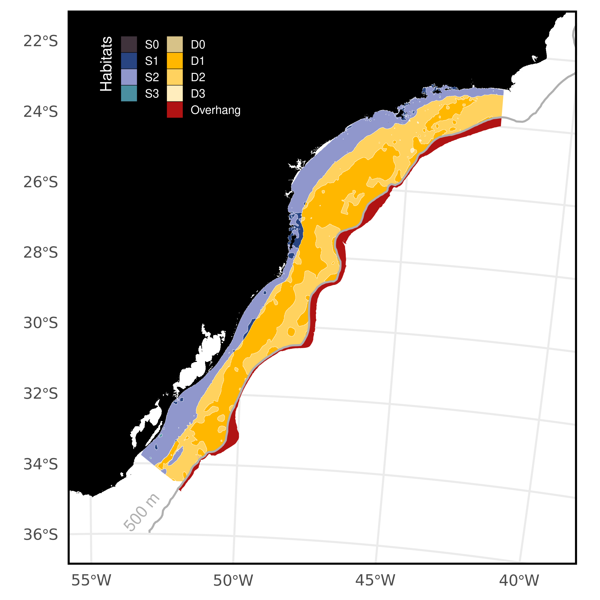
```

# Fixed Physical {-}

## Background {-}

#### Water column inshore/shallow and offshore/deep zone area proportions and layer thicknesses; seabed habitat area proportions and sediment properties: {-}

The depth boundary between deep and shallow layers was determined using vertical diffusivity values from NEMO-MEDUSA [@yool13] and mixed layer depth from Globcolour (www.globcolour.info/).
Shallow-deep layer division was set at 50m, with a bottom depth of 500m for the deep layer.
The overhang extends up to a maximum depth of 500m, covering the spatial area between the 500m and 1000m isobaths (without seafloor).
In the coastal zone, the polygon is defined for areas shallower than 50m or within 20 km of the coast.
Seabed habitat proportions and sediment properties were derived from data by the REVIZEE Program [@tessler04] and BNDO.

#### Parameters for relationship between median grain size, sediment porosity and permeability. Permeability is used as the basis for estimating hydraulic conductivity which is a parameter in the representation of sediment processes in the model: {-}

Porosity (proportion by volume of interstitial water) and permeability of each sediment habitat were derived from median grain sizes using empirically-based relationships.

$$log_{10}(porosity) = p_3 + p_4\left(\frac{1}{1+e^{(\frac{-log_{10}(D_{50})-p_1}{p_2})}}\right)$$ D~50~ = median grain size (mm); parameters p~1~ = -1.227, p~2~ = -0.270, p~3~ = -0.436, p~4~ = 0.366 [@heath21]

$$permeability = 10^{p_5}∙D_{50}^{*p_6}$$

where D~50~\* = 0.11 ≤ D~50~ ≤ 0.50 p~5~ = -9.213, p~6~ = 4.615 [@heath15].

These relationships are coded into the StrathE2E2 R-package with the parameters in the csv setup file for the SBS model.
The parameters are probably a reasonable starting point for any future model of a new region.
Derivation of the parameters is described in the following text sub-sections.

#### Parameters for in-built relationship between sediment mud content, and slowly degrading (refractory) organic nitrogen content of seabed sediments (see description in this document): {-}

Values for each sediment type derived from parameterised relationships between total organic nitrogen content of sediments (TON%, percent by weight), mud content (mud%, percent by weight) and median grain size (D~50~, mm).

$$mud\% = 10^{p_7}∙𝐷_{50}^{𝑝_8}$$ p~7~ = 0.657, p~8~ = -0.800

$$TON\% = 10^{𝑝_9}∙mud\%^{𝑝_{10}}$$

p~9~ = -1.965, p~10~ = 0.590

Proportion of TON estimated to be refractory = 0.9

These relationships, along with their parameters, are documented in the North Sea implementation of the StrathE2E2 package [@heath21].
While there may be regional variations, these relationships serve as a reasonable starting point for the SBS implementation.
The StrathE2E2 R-package encodes these relationships, with the parameters specified in the CSV setup file.
Derivation of the parameters is described in the following sub-sections.

## Model area proportions {-}

```{r area_proportions_cap}

tab_area_proportions_cap <- table_nums(name = "tab_area_proportions", 
    caption = stringr::str_glue("Area-proportions of the inshore and offshore zones and the thicknesses of the                                        water column layers. The sea surface area of the model domain is an estimated                                         {Area} km^2^."))
```

`r table_nums("tab_area_proportions")`

```{r area_proportions}

data_frame(Property = c("Sea-surface area proportion",
                        "Upper layer thickness (m)",
                        "Lower layer thickness (m)"),
           `Inshore/shallow` = c(model[["data"]][["physical.parameters"]][["x_shallowprop"]], 
                                 model[["data"]][["physical.parameters"]][["si_depth"]], 
                                 NA),
           `Offshore/deep` = c(1 - model[["data"]][["physical.parameters"]][["x_shallowprop"]], 
                               model[["data"]][["physical.parameters"]][["so_depth"]], 
                               model[["data"]][["physical.parameters"]][["d_depth"]])) %>% 
  gt() %>% 
  fmt_number(columns = c("Offshore/deep", "Inshore/shallow"), decimals = 4, use_seps = FALSE)


```

Data from the REVIZEE Program [@tessler04] and BNDO were used to create sediment maps, providing gravel, sand, silt, and clay percentages, along with mean grain diameter and additional statistics based on latitude and longitude.
These maps were converted into habitat polygons for calculating area-proportions (`r table.ref("tab_habitat_proportions")`).
Sediments were classified into gravel, sand, and mud (silt+clay), excluding rocks due to low resolution and negligible distribution at the model scale (Figure \@ref(fig:habitats)).

```{r habitat_proportions_cap}

tab_habitat_proportions_cap <- table_nums(name = "tab_habitat_proportions", 
    caption = stringr::str_glue("Area proportions and other characteristics of the 8 seabed habitat classes defined in the model by depth, rock or sediment type. The sea surface area of the model domain is an estimated {Area} km^2^. Grain size is the median in mm, Permeability in units of m^2^, nitrogen content in %dw."))
```

`r table_nums("tab_habitat_proportions")`

```{r habitat_proportions}

physical <- read.csv(str_glue("Files/{implementation}/{Period}/Param/physical_parameters_SBS.csv"))
  
proportions <- which(str_detect(physical$Description, "Area_proportion"))
porosity <- which(str_detect(physical$Description, "Defined_porosity"))
permeability <- which(str_detect(physical$Description, "Defined_permeability"))
nitrogen <- which(str_detect(physical$Description, "Defined_total_N"))
grain <- which(str_detect(physical$Description, "grain_size"))

depth_vector <- c(rep(c("Shallow"), each = 4), rep(c("Deep"), each = 5))
zone_vector <- c(rep(c("Inshore"), each = 4), rep(c("Offshore"), each = 5))

data_frame(Habitat = c("S0", "S1", "S2", "S3", "D0", "D1", "D2", "D3", "OV"),
           Depth = depth_vector,
           Zone = zone_vector,
           Sediment = rep(c("None (Rock)", "Fine", "Medium", "Coarse", "None (Rock)", "Fine", "Medium", "Coarse", "Overhang")),
           `Area Proportion` = physical$Value[proportions],
           `Grain size` = c(0, physical$Value[grain[1:3]], 0, physical$Value[grain[4:6]], NA),
           Porosity = c(NA, physical$Value[porosity[1:3]], NA, physical$Value[porosity[4:6]], NA),
           Permeability = c(NA, physical$Value[permeability[1:3]], NA, physical$Value[permeability[4:6]], NA),
           `Nitrogen content` = c(NA, physical$Value[nitrogen[1:3]], NA, physical$Value[nitrogen[4:6]], NA)) %>% 
  group_by(Zone, Depth) %>% 
  gt() %>% 
  fmt_number(columns = c("Area Proportion", "Grain size", "Porosity", "Permeability", "Nitrogen content"), 
                         decimals = 4, use_seps = FALSE) %>% 
  cols_align(align = 'center',
             columns = vars(`Area Proportion`, `Grain size`, Porosity, Permeability, `Nitrogen content`)) %>% 
  tab_options(row_group.background.color = "whitesmoke")


```

## Daily disturbance rates {-}

To calculate the natural disturbance rate, we needed depth-averaged current speeds (including tidal influence) and wave data.
We used data products from Copernicus Marine Data; however, only surface tide components were available instead of depth-averaged values, and the depth-averaged current speeds did not include tides.
Therefore, we approximated the influence of tides on the depth profile by assuming that the extra surface speed diminishes with depth at a certain decay rate.
We employed a rough approximation for non-stratification and a flat bottom from the National Oceanography Centre (NOC).
The equation assumes a constant speed in the upper half of the water column and attenuation in the lower half due to bottom friction, with speed decaying to zero at the bottom.

$$U_{} = U_{\text{current}} + \frac{U_{\text{tides }}}{1.07}$$ $$V_{} = V_{\text{current}} + \frac{V_{\text{tides }}}{1.07}$$

We used the Copernicus toolbox for subsetting the specific variables, the SBS domain, and the desired period via Command Line Interface (CLI), then post-processed the data in R.
Since the Copernicus Marine Data Store only hosts recent data for public download, we used data from 2022, the oldest full annual cycle available with all three variables.
Details about the products used below.

Waves: We used the Global Ocean Waves Analysis product (DOI: 10.48670/moi-00017) with a 1/12-degree resolution.
The parameters used every 3 hours were: significant wave height, mean wave direction, and primary swell wave period.
Specific variables included Sea surface wave significant height (VHM0, m), Sea surface wave direction (VMDR, °), and Sea surface primary swell wave mean period (VTM01SW1, s).

Currents: We used the Global Ocean Physics Analysis and Forecast product (DOI: 10.48670/moi-00016) with a 1/12-degree resolution.
The 6-hourly parameters used were Eastward sea water velocity (uo, m/s) and Northward sea water velocity (vo, m/s).

Tides: We used the Global Ocean Physics Analysis and Forecast product (DOI: 10.48670/moi-00016) with a 1/12-degree resolution.
The 1-hourly parameters used were Surface sea water x velocity due to tide (utide, m/s) and Surface sea water y velocity due to tide (vtide, m/s).

Even though the grid is shared, there were coastal cells with currents but missing data for waves and tides.
We interpolated missing coastal cells using the Voronoi tessellation method (nearest neighbor).
We also interpolated the depth-averaged currents and waves to match the hourly timestep of the tides using the `approx` function.

We combined all data into a single dataset and applied functions from the `bedshear` package to calculate bed shear stress for the six habitat types.

## Sediment porosity {-}

Log-transformed porosity has been shown to have a sigmoidal relationship with log~10~(median grain size) (D~50~, mm) [@wilson18]:

$$log_{10}(porosity) = p_3 + p_4\left(\frac{1}{1+e^{(\frac{-log_{10}(D_{50})-p_1}{p_2})}}\right)$$

We use this relationship to calculate porosity for sea bed sediments in the SBS (`r table.ref("tab_habitat_proportions")`), using an alternative parameterisation to Wilson [@pace21].
This alternative set of parameters extends the relationship to fine, muddy sediments (`r table.ref("tab_porosity")`).

```{r porosity_cap}

tab_porosity_cap <- table_nums(name = "tab_porosity", 
    caption = "The four parameters for the function relating sediment porosity to median grain size. From Pace et al. (in review)")
```

`r table_nums("tab_porosity")`

```{r tab_porosity}

d50_to_pore <- which(str_detect(physical$Description, "porosity_and_grainsize"))

data_frame(Parameter = paste0("P", 1:4),
           `Fitted value` = physical$Value[d50_to_pore]) %>%
  pivot_wider(names_from = Parameter, values_from = `Fitted value`) %>% 
  gt()

```

## Hydraulic conductivity {-}

Hydraulic conductivity (H, m.s^-1^) represents the ease with which fluids flow through the particle grain matrix.
The related term 'permeability' (m^-2^) is a measure of the connectedness of the fluid filled void spaces between the particle grains.
Permeability is a function only of the sediment matrix, whilst conductivity is a function of both the sediment and the permeating fluid, in particular the fluid viscosity and density.
Hydraulic conductivity is related to permeability by:

$$H = Permeability∙fluid\;density∙\frac{𝑔}{dynamic\;viscosity}$$ where: seawater density = 1027 kg.m^-3^ at salinity 35 and temperature 10°C; seawater dynamic viscosity = 1.48 x 10^-3^ kg.m^-1^.s^-1^ at salinity 35 and temperature 10°C; g = acceleration due to gravity = 9.8 m.s^-1^

Hence, $H = Permeability · 6.8004·10^6$ (m.s^-1^ at salinity 35 and temperature 10°C)

Whole sediment permeability can be related to the proportion of sediment classed as mud (D~50~ \< 62 μm) [@pace21].
In this model implementation, this relationship is utilized for internal calculations.

## Sediment organic nitrogen content {-}

The magnitude of the static (refactory) organic nitrogen detritus pool in each sediment type is a required input to the model.
The code includes an option to impute values from empirical relationships between total organic nitrogen (TON) and mud content, and between mud content and median grain size.
This relationship has been documented in the North Sea implementation [@heath21].
For the SBS implementation, the total nitrogen content is internally calculated and based on that relationship.

# Fixed biological {-}

## Configuration parameters {-}

### Assimilation efficiencies for each living guild in the model. {-}

Fixed parameters defining the proportion of ingested mass of food that contributes to new body tissue, after subtracting defecation and the metabolic costs of digestion and synthesis [@heath12].

### Biomass loss rates due to temperature-dependent metabolism for each living resource guild. {-}

Proportion of biomass lost to ammonia per day due to non-feeding related metabolism at a given reference temperature.
Rates for individual guilds broadly related to typical body mass of representative species.
Temperature dependency following a Q~10~ function.

### Q~10~ values for temperature dependent processes, and the Q~10~ reference temperature. {-}

Separate Q10 values for autotrophic uptake of nutrient, heterotrophic feeding, and heterotrophic metabolism based on literature data.

### Light intensity required to saturate autotrophic nutrient uptake. {-}

Light saturation intensity for nutrient uptake cannot be treated as a fitted value since it is confounded with other uptake parameters.
Value estimated from survey of laboratory experiments.

### Annual weight specific fecundities of planktivorous and demersal fish guilds and the two benthos guilds in the model (suspension/deposit feeders and carnivore/scavenge feeders). {-}

Guild-level values derived by surveying the literature.

### Harvestable biomass density threshold for each resource guild. {-}

The living resource guilds in the model represent a mixture of harvestable and non-harvestable species, especially the invertebrate guilds.
The density threshold parameter sets a limit for the guild biomass below which the harvestable species are assumed to be exhausted.
Values set from analysis of trawl, plankton and benthos survey species biomass compositions.

### Minimum inedible biomass of carnivorous zooplankton. {-}

The carnivorous zooplankton guild is a key component of the food web, predated on by all the fish and top-predators.
However it represents an extremely diverse range of fauna many of which are not edible in significant quantities by the guild predators, e.g. scyphomedusae.
A minimum edible threshold is set to ensure that the guild as a whole cannot be extirpated by predation.
The value is a rough estimate of scyphomedusae biomass.

## Event timing parameters (not fitted) {-}

### Spawning and recruitment start and end dates for fish and benthos {-}

We gathered the spawning and recruitment periods for each guild based on literature regarding the main species, described below.
In the model the annual weight-specific fecundity is assumed to be shed uniformly between the start and end dates of spawning.
The annual cohort of larvae/juveniles of each fish and benthos guild is assumed to recruit to the settled stage at a uniform daily rate between the start and end dates.

#### Planktivorous {-}

For the planktivorous guild, we gathered data on the most caught species, Brazilian sardinella (*Sardinella brasiliensis*).
The closed fishing season in SBS is set from November 1st to February 15th until 2019 (@ibama09), to cover the spawning period, and from June 15th to July 31th to protect the recruitment period.
However, in 2020 the closed season changed to October 1st to February 28th to cover a large spawning period and better align with the species' reproductive patterns (IN Nº 18, IBAMA, 2020).
The spawning period occurring in austral spring and summer and the recruitment in winter also aligns with the literature (@cergole02; @moraes12; Pio and Schwingel, 2012).
We also check that the reproductive period of the second most caught planktivorous species, the Atlantic thread herring (*Opisthonema oglinum*), coincides with the reproductive cycle of *S. brasiliensis*, along with other small pelagic species (Feltrim and Schwingel, 2005; @petermann16).
Based on that, and to align with both closed seasons settled in SBS, we defined the spawning period of Planktivorous guild from October 1st to February 10th, and the recruitment from June 15th to August 15th.

```{r sardine, echo=FALSE, fig.align='center', fig.cap=" Life cycle of the Brazilian sardine (*Sardinella brasiliensis*). Adapted from Gouveia (2016) and Soares et al. (2011).", out.width = '50%'}
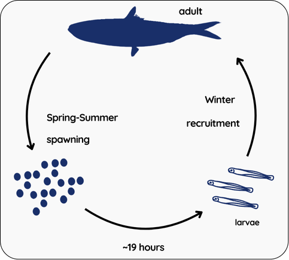
```

#### Demersal {-}

For the demersal guild, we focused on the key species in SBS, the Whitemouth croaker (*Micropogonias furnieri*).
Although studies in the SBS lack specific dates, there is an indication of spawning during winter and spring, extending into summer (@isaac-vazzoler83), with peaks in August and November (Carneiro et al., 2005).
The spawning of *M. furnieri* overlaps with the recruitment periods within the region's estuaries, given the species' brief residence within the planktonic phase (Isaac-nahum and Vazzoler, 1987).
The recruitment persists uninterruptedly during the year, but it is strong between May and June, as postulated by @vazzoler91.
Based on these information revised, we defined a broad spawning and recruitment period from September 1st to April 1st, and March 1st to October 1st, respectively.
Other commercially significant demersal species in the SBS, such as the Argentine croaker (*Umbrina canosai*), the King weakfish (*Macrodon ancylodon* and *Macrodon atricauda*), and the striped weakfish (*Cynoscion guatucupa*) also exhibits prolonged or multiple spawning episodes, especially from late winter to late spring (@haimovici97; @zaneti79; Haimovici et al., 2006, Cardoso and Haimovici, 2014, Haimovici and Cardoso, 2017), aligning with the inferred dates.

#### CS Benthos {-}

For the carnivorous and scavengers benthos guild, we inferred the reproductive cycle of shrimps, although it varies with species and location and lacks a scientific consensus in the region.
In the model baseline period, the Brazilian shrimp regulations (IBAMA nº 189/2008) banned catching pink-shrimp (*Farfantepenaeus paulensis*) juveniles during their recruitment and spawning phase, between March to May.
However, fishermen challenged this, suggesting that February to May was the correct period to address all shrimp species reproduction in the SBS.
After discussions, the closed season was adjusted for January to April from 2023 onward (@sap22).
Multiple recruitment year-round are observed in shrimp studies in Brazil (Branco et al., 2013; Martins et al., 2013; @heckler13), making complete protection through closed seasons challenging.
@heckler13 highlights spawning peaks in February, March, and April for the seabob shrimp *Xiphopenaeus kroyeri* during spring/summer, attributed to the South Atlantic Central Water Mass presence in Santos Bay, enhancing recruitment efficiency in summer compared to other periods.
According to Fransozo et al. (2000), recruitment of *X. kroyeri* occurs throughout the year, but with greater intensity between November and March.
Based on all that information compiled, we defined the spawning period from February 1st to April 1st and the recruitment during November 1st to May 1st.

#### SD Benthos {-}

Regarding the suspension and deposit feeders benthos, we combined the spawning period of mussel (*Perna perna*) and oyster (*Crassostrea brasiliana*).
*P. perna* spawns from September 1st to December 31th in SBS, following the closed fisheries regulations (@ibama06).
The recruitment of P. perna is prominent in the spring (late August to early November) (Ferreira et al., 2007).
Other researchers point to the species' highest recruitment during early summer (@marenzi05) and November to January (@henriques04).
As for *C. brasiliana*, fisheries close due to spawning from December 18th to February 18th (@sudepe86).
To cover both species reproductive patterns we set the guild spawning period between September 1st to February 1st and the recruitment from August 1st to January 1st.

### Extra-domain stock biomass of migratory, and the proportion invading the domain each year. Start and end dates for the annual invasion, and start and end dates for the emigration. (see description below). {-}

The main migratory fish species undertaking a seasonal transit in SBS is the skipjack tuna (*Katsuwonus pelamis*).
Data on the Atlantic stock biomass of the skipjack and others relevant migratory fish, the proportion entering the SBS and the timing of the migration, were derived from literature and stock assessments (@jablonski85; @soares19; @arregui20; @iccat; @sau).

```{r tuna, echo=FALSE, out.width = '100%'}
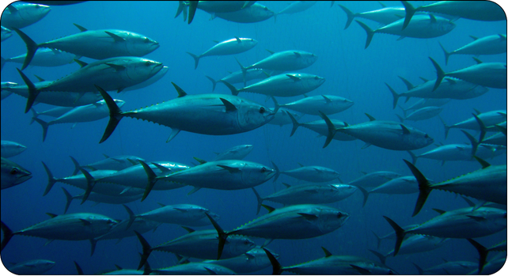
```

## Event timing parameters (fitted) {-}

The skipjack tuna (*Katsuwonus pelamis*) is a key migratory species in the SBS model, sustaining the pole-and-line fishery.
In the region, a single stock unit utilises three geographic areas along the Brazilian coast (South, Southeast, and Northeast), with a north-south migration pattern in Brazil during summer and fall (@jablonski83, Soares et al., 2019).
Recruitment peaks in May and October, suggesting consistent smaller influxes in fall and spring (@arregui20).
Spawning occurs sporadically in the SBS under favourable oceanographic conditions, but the main spawning grounds are located in the North and Northeast Brazil, peaking from December to February, the summer months (@jablonski83; Goldberg and Au, 1986, Soares et al., 2019; Katsuragawa et al., 2020).
After spawning, skipjack schools migrate southward, primarily driven by the Brazil Current (Matsuura and Andrade, 2000; Castro et al., 2006).

Other migratory species, such as albacore tuna (*Thunnus alalunga*), spawn between October and March along the Brazilian coast before migrating to South Africa in the winter (Pedrosa, 2011).
Yellowfin tuna (*Thunnus albacares*) also undergoes semi-annual migrations between the equatorial zones and the southern and southeastern coasts of Brazil (Zavala-Camin, 1978).
Similarly, bluefish (*Pomatomus saltatrix*) exhibit seasonal migration patterns, moving to warmer waters during the winter and cooler waters during the summer (CEPSUL, 2009; Haimovici et al., 1996).
A portion of the adult populations of tunas, tuna-like species, and sharks appears to be resident in the SBS, remaining in the region without undertaking long-distance migrations (Pedrosa, 2011; @arregui20).
Based on this information, we considered that the migratory guild exhibits a seasonal migration pattern, moving to warmer waters in winter and cooler waters in summer.
The immigration period was set from October 1st to May 31th and emigration from June 1st to August 31th.
We also assumed that 40% of the population remains within the model domain even during the immigration period, representing the residual proportion of peak abundance in the SBS.

For the purposes of the model, we assume that there is no feedback between fishing and environmental conditions and the biomass and migration patterns.
In this version of StrathE2E the timing of immigration and emigration, and the mass influx across the ocean boundary during the annual immigration phase are treated as period-specific external driving data.

To estimate the proportion of the migratory stock entering the SBS, we assessed the biomass in both the Atlantic Ocean and the SBS domain.
There are currently no official stock assessments from the Brazilian government for tuna or shark species in the SBS.
Part of the management of migratory fish stocks falls under the International Commission for the Conservation of Atlantic Tunas (ICCAT), which relies on a consensus-based decision-making process among its member nations.
To approximate the migratory fish biomass within the SBS, we compiled data for 34 taxa, including key species such as the aforementioned skipjack, yellowfin, bigeye, and albacore tuna, along with Atlantic sailfish (*Istiophorus albicans*), swordfish (*Xiphias gladius*), dolphinfish (*Coryphaena hippurus*), white marlin (*Kajikia albida*), blue marlin (*Makaira nigricans*), wahoo (*Acanthocybium solandri*), several shark species (*Carcharhinus obscurus*, *C. limbatus*, *C. signatus*, *Galeocerdo cuvier*, *Isurus oxyrinchus*, *Mustelus schmitti*, *Prionace glauca*, *Sphyrna zygaena*, *S. lewini*, *Squalus spp.*, *Squatina spp.*), among others.
Biomass data were sourced from previous Ecopath models in the SBS (@gasalla07; @bornatowski18; Rupp and Bornatowski, 2021), as well as stock assessments from SAU, which are largely based on ICCAT data and the CMSY method (@sau; see www.seaaroundus.org/cmsy-method for details).
SAU biomass estimates are available for the period from 2010 to 2018, and we used average values for our calculations.

When utilising parameters from Ecopath models, we adjusted biomass estimates to reflect the specific area size of our study.
For SAU stock assessments, we ensured that the marine ecoregion aligned with the SBS; in cases where the assessment covered a broader region (e.g., the South Atlantic), we adjusted biomass values using catch ratios of the broader region relative to our SBS catches.
For skipjack tuna specifically, we relied on local sources, such as Cardoso et al. (2020), which provided a stock assessment for 2020.

As a result, we estimated an annual migratory fish biomass of 570275 tons or 1.83 t.kmˆ-2ˆ in the SBS.
The Atlantic Ocean migratory fish biomass was estimated using available stock assessments for the main 18 species from SAU and ICCAT, resulting in a rough estimate of 3538302 tons.
Thus, the calculated proportion of the migratory stock entering the SBS was 16.12%.

The model setup code calculates the parameters which are needed in the ecology model.
These are the only fixed (i.e. non-fitted) ecology model parameters which are period-specific.

```{r migrant_cap}

tab_migrant_cap <- table_nums(name = "tab_migrant", 
    caption = "Biological event timing parameters, constant across the 2010-2070 time period. The data are processed in the model setup to calculate the immigration flux parameters needed in the ecology model. Spawning and recruitment durations were established assuming a month with 30 days.")
```

`r table_nums("tab_migrant")`

```{r tab_migrant, fig.cap = tab_migrant_cap}

data_frame(Parameter = model[["data"]][["biological.events"]][["Description"]] %>% 
                        str_replace_all("_", " "),
           Value = model[["data"]][["biological.events"]][["Value"]]) %>% 
  .[1:13,] %>% 
  gt() %>%
  fmt_number(
    decimals = 2,
    use_seps = FALSE
  )

```

\newpage

`r table_nums("tab_migrant", display = "cite")` Continued.

```{r tab_migrantb}

data_frame(Parameter = model[["data"]][["biological.events"]][["Description"]] %>% 
                        str_replace_all("_", " "),
           Value = model[["data"]][["biological.events"]][["Value"]]) %>% 
  .[14:26,] %>% 
  gt() %>%
  fmt_number(
    decimals = 2,
    use_seps = FALSE
  )
```

# Ecological drivers {-}

Monthly resolution time-varying physical and chemical driving parameters for the model were derived from a variety of sources:

-   Temperature, vertical mixing coefficients, volume fluxes, and boundary nutrient, detritus and phytoplankton concentrations from outputs of a NEMO-ERSEM coupled hydro-geochemical model run at SSP370 with a 2010-2019 historical/future split[@yool13].
-   Surface shortwave radiation, surface air temperature, and freshwater volume outflows from HadGEM2-ES model output [@jones11] used to force the NEMO-MEDUSA coupled hydro-geochemical model mentioned above [@yool13].
-   River nitrate and ammonia concentrations estimated from GRQA database (Global River Water Quality Archive, @virro21)
-   Atmospheric deposition of nitrate and ammonia from ISIMIP3a ([Inter-Sectoral Impact Model Intercomparison Project](https://data.isimip.org/10.48364/ISIMIP.759077.2); [@yang22])
-   Remote sensing data products on Suspended Particulate Matter (Globcolour L3b; <ftp://ftp.hermes.acri.fr/GLOB/merged/month/>).
-   Habitat disturbance due to tidal currents and waves from..
-   Wave height, period, and direction from the ERA-5 reanalysis monthly means accessed through [CDS](https://cds.climate.copernicus.eu/cdsapp#!/dataset/10.24381/cds.f17050d7?tab=overview) for 1980-2021 [@Hersbach19].

Details of how these data were processed are given below, supported by the [nemomedusR](https://jack-h-laverick.github.io/nemomedusR/) packages.

### Vertical mixing coefficients between the upper and lower layers of the deep zone: {-}

Vertical diffusivity from the NEMO-MEDUSA coupled hydro-geochemical model output [@yool13] was interpolated for each grid cell at the SDepth m boundary depth between the shallow and deep layers of the offshore zone.
These values were summarised as monthly averages into period-specific climatological annual cycles of data for the simulation periods.

### Monthly averaged temperatures for each water column layer: {-}

Derived by monthly averaging values at grid points within the inshore and vertical layers of the offshore zones from the NEMO-MEDUSA coupled hydro-geochemical model output [@yool13], weighted by grid point volumes.
Values were summarised into period-specific climatological annual cycles of data for the simulation periods.

### Monthly averaged suspended particulate matter (SPM) concentrations (mg.m^-3^) in the shallow zone and the deep zone upper layer: {-}

Monthly averaged values of inorganic suspended particulate matter in sea water are available from the Globcolour project, starting from September 1997.
These data are derived from satellite observations using the algorithm of Gohin [-@gohin11].
Data were downloaded from the ftp server (<ftp://ftp.hermes.acri.fr/GLOB/merged/month/>).
We summarised these values as zonal statistics for the model domain to acquire a climatological annual cycle of data for the 2010-2019 simulation period only.

### Monthly average light attenuation coefficients for the inshore and offshore surface layers: {-}

Light attenuation in open water was parameterised from a linear relationship between the light attenuation coefficient and suspended particulate matter concentration (SPM) (Devlin et al., 2008).

### Monthly averaged daily integrated irradiance at the sea surface (E.m^-2^.d^-1^): {-}

Derived from HadGEM2-ES model output [@jones11] which forces the NEMO-MEDUSA model run used throughout our implementation.
Monthly mean values were summarised into a climatological annual cycle of data for the simulation periods.

### Monthly averaged daily atmospheric deposition rates of oxidised and reduced nitrogen onto the sea surface in the shallow and deep zones (mMN.m^-2^.d^-1^): {-}

Sourced from the "histsoc" files for a 1901 - 2021 hindcast as monthly averages [@yang22], available from [CDS](https://cds.climate.copernicus.eu/cdsapp#!/dataset/10.24381/cds.f17050d7?tab=overview).
Monthly values were summarised into climatological annual cycles of monthly oxidised and reduced nitrogen deposition rates extracted for 2010-2019.
Projections under different SSPs are also available to 2100.

### Monthly averaged, freshwater river inflow rates (expressed as a daily proportion of the receiving layer volume), and concentrations of oxidised and reduced dissolved inorganic nitrogen in the inflowing river waters (mMN.m^-3^): {-}

Freshwater inflow derived from HadGEM2-ES model output [@jones11] which forces the NEMO-MEDUSA model run used throughout our implementation.
Monthly values were summaries into a climatological annual cycle of data for all periods.

### Volume fluxes into the model domain across open sea boundaries, and from the upper layer of the offshore/deep zone into the inshore/shallow zone, expressed as proportions of the receiving layer volume per day: {-}

Monthly averaged daily inflow and outflow volume fluxes derived by integrating daily mean velocities directed perpendicular to transects along the model domain boundary at grid points in each depth layer along transects through outputs from the NEMO-MEDUSA coupled hydro-geochemical model output [@yool13].
Monthly averaged daily inflow volume fluxes then divided by the volume of the receiving layer in the model domain to estimate a daily flushing rate.
Period-specific climatological annual cycles of data used for simulation periods.

### Mean concentrations of nitrate, ammonia, phytoplankton and suspended detritus (mMN.m^-3^), in adjacent ocean waters inflowing to the offshore/deep zone upper layer, adjacent ocean waters inflowing to the offshore/deep zone lower layer, and adjacent shelf waters inflowing to the inshore/shallow zone: {-}

NEMO-MEDUSA outputs included phytoplankton and suspended detritus, as well as Dissolved Inorganic Nitrogen (DIN).
We calculated the depth-averaged concentrations for pixels within the shallow and deep layers of StrathE2E.
We then sampled the pixels using the same transects around the model domain as for sampling volume fluxes.
Only transects where water flowed into the model domain were sampled, and the average concentration of inflowing waters for target variables was calculated weighting by the flow rate across a transect and the cross-sectional area represented by a transect (average depth and length).
Concentrations were then averaged into climatological annual cycles for all periods.

The GRQA (@virro21) database was utilized, providing nitrate and ammonium concentrations in mg/l from continental and global observation datasets.
Data were filtered for Brazilian rivers along the SBS coastline, and those inflowing to the inshore zone were selected.
Outliers were identified using the IQR method.
The resulting values were converted into monthly mean concentrations of nitrate and ammonia in river waters flowing into the model in mMN.m^-3^., as a chemistry driving parameter for SBS StrathE2E.

# Fishing fleet {-}

## Background {-}

The key configuration data for the fishing fleet model are the definitions of the gears in terms of their power with respect to each of the harvestable resource guilds, discards and bycatch rates, processing-at-sea rates, and seabed abrasion rates.
These can be regarded as static parameters for each fleet.
Species were categorized into the commercial guilds based on ecological properties using sources like FishBase (Froese and Pauly, 1999).

The selection of the predominant SBS fleets was based on an extensive review of fisheries databases and regional monitoring reports, covering both artisanal and industrial fleets.
Fleets were grouped by operational similarities and targeted species, while also considering potential SBS policies and management scenarios.
Twelve fleets were identified: Fish trawl, Bottom gillnet, Surface gillnet, Bottom longline, Surface longline and lines, Pink-shrimp trawlers, Seabob-shrimp trawlers, Pole and line, Purse and beach seines, Traps (benthos), Trap nets, and Others/multiple fleets.
A general description of each fleet is provided below.

The most significant fishery in the SBS, by volume, targets the Brazilian sardine (*Sardinella brasiliensis*), the most abundant and commercially valuable fish in Brazil.
Historical stock collapses due to biomass declines (Barange et al., 2009; Cergole and Dias Neto, 2011; Dias, 2012) have led to other sardine species likethe false herring *Harengula clupeola* and the atlantic thread herring *Opisthonema oglinum*, as well as other small pelagic fish, being targeted.
In the model, the purse-seine fleet is grouped with other net types targeting sardines under the "Purse and Beach Seines" fleet, which is mainly industrial.
Though spread across all SBS states, the fleet's landings are concentrated in Itajaí and Navegantes (SC), where major processing industries are located (OCEANA, 2024).
While purse-seine fishing generally has low environmental impacts, such as bycatch and seabed disturbance, concerns remain that current management may fail to address the sardine's critical role as a forage species.
Furthermore, the fleet is not managed as a multi-species fishery, despite catching significant amounts of other small pelagics, with most assessments focusing solely on the Brazilian sardine (OCEANA, 2024).

```{r traineira, echo=FALSE, fig.align='center', fig.cap="Purse-seine vessel for the Brazilian sardine in the SBS, know as 'traineira'. Image from SINDIPI.", out.width = '80%'}
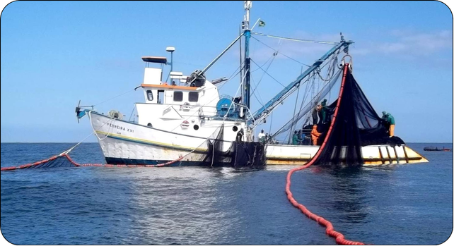
```

We also considered the “Trap net” fleet, regional fish traps known as "cerco fixo" and "cerco flutuante".
These are primarily artisanal traps targeting demersal and small pelagic species such as grey mullets (*Mugil spp.*), Argentine croaker (*Umbrina canosai*), jacks (*Caranx spp.*), and sardines, and are typically placed in sheltered areas such as estuaries.
Studies on catch composition, discards, or bycatch for these traps not targeting the Brazilian sardine are rare, as are specific legal frameworks for these fleets (OCEANA, 2024).
A discard rate for demersal fish was applied, and the bycatch of seabirds and cetaceans is not documented in the literature.

Following the purse-seine fleet, gillnets represent the second most significant fleet in terms of catch volume in the SBS.
Here, gillnets are divided into surface gillnets and bottom gillnets.
The bottom gillnet fleet primarily targets demersal species such as the whitemouth croaker (*Micropogonias furnieri*), Argentine croaker (*Umbrina canosai*), king weakfish (*Macrodon ancylodon* and *Macrodon atricauda*), and striped weakfish (*Cynoscion guatucupa*).
Approximately 60% of this fleet is industrial, while the remaining 40% is artisanal.
The bottom gillnet fleet operating in the SBS is the largest in the country by the number of registered vessels, with 5,009 units - accounting for around 23% of the total Brazilian fleet (OCEANA, 2024).
This fleet encompasses various fisheries, making it difficult to uniformly characterise its operational patterns and impacts on non-target species.
Industrial vessels generally have greater mobility and selectivity, while small to medium-sized vessels tend to operate closer to their home ports, capturing a broad range of demersal species (OCEANA, 2024).
Our model considers a significant amount of bycatch and discards targeting non-commercial demersal species, as well as carnivorous and scavenger benthic species, and cetaceans.
In contrast, the surface gillnet fleet is predominantly artisanal (87%) and highly multispecies.
The most commonly caught species during the baseline period were bluefish (*Pomatomus saltatrix*) and grey mullet (*Mugil liza*).
We also considered high levels of discards and bycatch, including accidental captures of cetaceans, pinnipeds, and seabirds in the SBS.
The surface gillnet fleet operates across all SBS states, with Santa Catarina and São Paulo having the largest presence.
Regional differences are reflected in gear specifications, as well as operational patterns, landings, and impacts on non-target species (OCEANA, 2024).
A total of 1,127 vessels are registered for surface gillnet fishing according to OCEANA (2024).

Trawlers in the SBS are divided into three main fleets: Fish trawl, Pink-shrimp trawlers, and Seabob-shrimp trawlers, based on the trawling system used and target species.
The fish trawl fleet is predominantly industrial, using mainly bottom-pair trawls to catch demersal fish such as whitemouth croaker (M*icropogonias furnieri*), Argentine croaker (*Umbrina canosai*), and striped weakfish (*Cynoscion guatucupa*).
This fleet produces significant discards, primarily non-target demersal fish (Cardoso et al., 2021).
Coastal bottom trawling consists of 64 mostly industrial vessels, bottom-pair trawling targeting sciaenid fish involves 110 registered vessels, and deep-sea trawling for demersal species includes 7 industrial vessels in the SBS according to OCEANA (2024).

The pink-shrimp trawlers fleet is also mainly industrial, primarily targeting the pink shrimp species *Farfantepenaeus paulensis* and *Farfantepenaeus subtilis* using double-rig trawls.
Other species such as Argentine stiletto shrimp (*Artemesia longinaris*), Argentine hake (*Merluccius hubbsi*), flounder (*Paralichthys spp.*), and bluewing searobin (*Prionotus punctatus*) are also caught.
This fleet consists of 392 registered vessels, mainly operating in Santa Catarina, Rio de Janeiro, and São Paulo (OCEANA, 2024).
While the fishery catches a wide range of marine species, specific regulations only exist for a few species to reduce incidental bycatch (OCEANA, 2024).
We considered significant discards of demersal fish from this fishery as well as seabed abrasion.

```{r pink-trawl, echo=FALSE, fig.align='center', fig.cap="Double-rig trawl vessel usually targeting the pink-shrimp in the SBS; Image from SINDIPI.", out.width = '70%'}
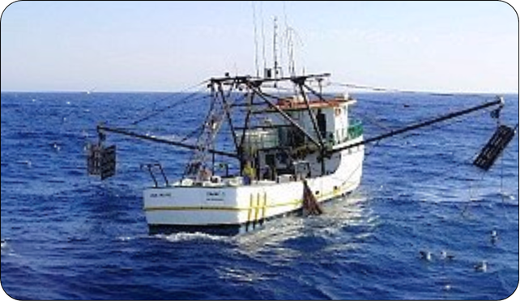
```

Seabob-shrimp trawlers are primarily artisanal, using bottom-otter trawls to catch seabob shrimp (*Xiphopenaeus kroyeri*) alongside other shrimp species and demersal fish.
Seabob shrimp is the most harvested crustacean along the Brazilian coast, with São Paulo and Santa Catarina being the key producers in the SBS region (OCEANA, 2024).
There are 3,145 vessels registered for this fishery, mostly small boats operating close to their home ports (OCEANA, 2024).
Bycatch and discards from this fleet encompass various guilds.
Seabed abrasion is also a significant ecological impact associated with this fleet.

Longline fishing was divided into bottom longline and surface longline, with handlines also considered.
Surface longline targets mainly tunas, dolphinfish (*Coryphaena hippurus*) and swordfish (*Xiphias gladius*), on the continental slope at depths greater than 200 m.
The national fleet operating in this fishery consists of more than 600 vessels, the majority being industrial (OCEANA, 2024).
Discards include demersal species (as sharks) and migratory species (sharks and billfish), and bycatch rates for seabirds are notably high.
Bottom longline targets demersal species such as the sandperch (*Pseudopercis numida*), catfish (*Genidens spp*; *Bagre marinus*), and tilefish (*Lopholatilus villarii*, *Caulolatilus chrysops*).
This fleet consists of 167 vessels, mostly small, based in Rio de Janeiro state (OCEANA, 2024).
It also discards significant quantities of demersal fish, though bycatch rates for seabirds and other species guilds were not considered.

The pole-and-line fleet is an industrial fishery that targets skipjack tuna (Katsuwonus pelamis).
Operates by first catching Brazilian sardine (*Sardinella brasiliensis*) to use as live bait onboard.
The fleet then locates and attracts tuna schools with the live bait, capturing one-by-one with poles, lines, and hooks (OCEANA, 2024).
Currently, there are 50 registered industrial vessels participating in this fishery (OCEANA, 2024).
This fleet is highly selective, resulting in minimal discards within the migratory fish guild.

```{r pole-and-line, echo=FALSE, fig.align='center', fig.cap="Pole-and-line operation in the SBS targeting the skipjack tuna. Image from  Lauro Madureira.", out.width = '80%'}
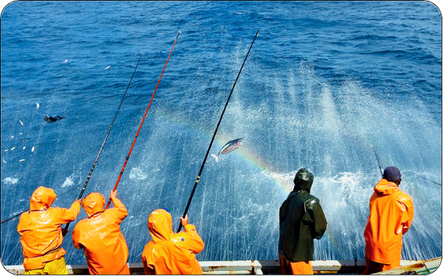
```

We grouped the benthos-targeting gear under the "Traps (benthos)" fleet, which includes traps for crabs, fish pots, and regional artisanal gears (e.g., “puçá” for shrimp).
Approximately 54% of this fleet is artisanal, while 46% is industrial.
It primarily targets crabs, octopus, and some demersal fish.
There are 24 industrial vessels targeting octopus (*Octopus vulgaris*, *Octopus insularis*) and 2 vessels targeting deep-sea crab (*Chaceon notialis*) in the SBS (OCEANA, 2024).
We assume discards mainly affect the demersal fish guild, though other ecological impacts, such as seabed abrasion and bycatch, are considered minimal.

We grouped all other gear types present in the fishing databases, which operate in smaller proportions, under the "Other/Multiple Gear" fleet.
This category includes regional artisanal gears and hand gathering.
Although multispecies, primarily dominated the demersal fish guild (such as whitemouth croaker and other Sciaenidae) as well as suspension and deposit-feeding benthos ( shellfish and mussels).
There is minimal discard associated with these gears, and bycatch is not reported in the literature.

The methodology for compiling data on fishing parameters for each of the described fleets is detailed in the subsequent sections.

```{r fleets1, echo=FALSE, fig.cap="Fishing fleets defined for StrathE2E SBS, their operational descriptions, target-species and discards levels.", out.width = '110%'}
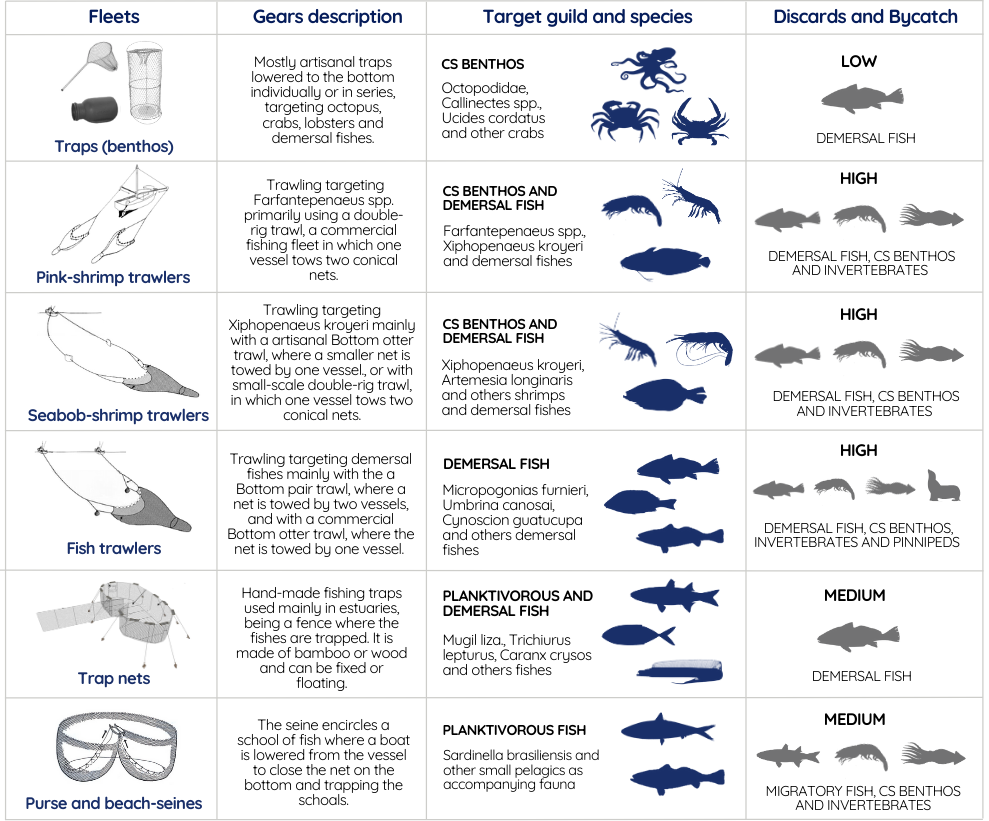
```

```{r fleets2, echo=FALSE, fig.cap="Continued. Fishing fleets defined for StrathE2E SBS, their operational descriptions, target-species and discards levels.", out.width = '110%'}
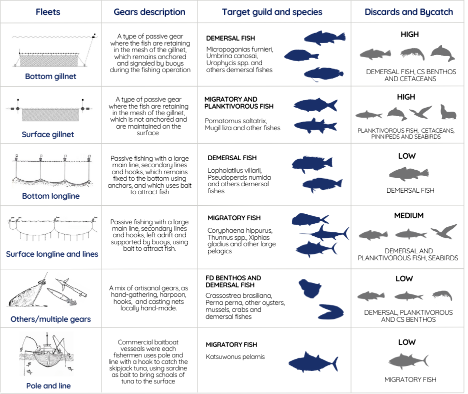
```

## Landings {-}

In Brazil, there is no national governmental fisheries monitoring program.
For model parameterization, we compiled annual fisheries landings data from 2010 to 2019, categorized by state, year, species, guild, and fishing type (artisanal or industrial).
Most of the data used for the model came from the Statistical Fisheries Monitoring Project (Programa de Monitoramento da Atividade Pesqueira da Bacia de Santos, PMAP-BS), which monitors landings from artisanal and industrial fleets in the states of Rio de Janeiro, São Paulo, Paraná, and Santa Catarina (@pmap_pr, @pmap_rj, @pmap_sc, @pmap_sp), as well as other state-specific sources (FURG-SEMA, FUNDEPAG-PR, CEPSUL-RS).
When data for certain fleets or years were unavailable, reconstructed data from Freire et al. (2021) were used.
Common names were standardized, and 115 species were categorized into six commercial guilds based on their ecological characteristics, using databases like FishBase (Froese and Pauly 1999; <https://www.fishbase.se/>).

```{r pmap_cap}

tab_pmap_cap <- table_nums(name = "tab_pmap", 
    caption = "Aggregation of the fishing fleets for the SBS StrathE2E model")
```

`r table_nums("tab_pmap")`

```{r tab_pmap, fig.cap = tab_pmap_cap}

gear_tab <- data.frame(
  `Fleets StrathE2E SBS` = c("Traps (benthos)", "Pink-shrimp trawlers", "Seabob-shrimp trawlers", "Fish trawl", "Trap nets", "Purse and beach seines", "Bottom gillnet", "Surface gillnet", "Bottom longline", "Surface longline and lines", "Others/multiple gear", "Pole and line"),
  `Gears PMAP (english|portuguese)` = c(
    "Traps crabs|Armadilha caranguejo; Fish pots|Covo e gaiola; 'Puçá'; Pots|Potes",
    "Double-rig trawl|Arrasto duplo (industrial); 'Aviãozinho' (50%); 'Genival/Gerival' (50%)",
    "Bottom otter trawl|Arrasto simples (artesanal); Double-rig trawl|Arrasto duplo (artesanal); 'Aviãozinho' (50%); 'Genival/Gerival' (50%)",
    "Bottom otter trawl|Arrasto simples (industrial); Bottom pair trawl|Arrasto de parelha; Manual trawling|Arrasto manual",
    "Artisanal trap-fishing|Cerco fixo; Artisanal trap-fishing|Cerco flutuante",
    "Purse seine|Cerco traineira; Artisanal drift net|Emalhe anilhado; Beach seine|Arrasto de praia",
    "Gillnet|Emalhe (proportion)",
    "Gillnet|Emalhe (proportion)",
    "Bottom longline|Espinhel de fundo; Several longlines|Espinhéis diversos (proportion)",
    "Surface longline|Espinhel de superfície; Several longlines|Espinhéis diversos (proportion); Several lines|Linhas diversas",
    "Multiple gears|Múltiplos petrechos; Harpoon|Arpão/fisga; Hand gathering|Coleta manual/extrativismo; Artisanal Hook|Gancho; Casting-net|Tarrafa",
    "Pole and line|Vara isca-viva"
  ),
  check.names = FALSE
)

gear_tab$`Gears PMAP (english|portuguese)` <- str_replace_all(gear_tab$`Gears PMAP (english|portuguese)`, ";", "<br>")

tab <- gear_tab %>%
  gt() %>%
  tab_options(
    table.font.size = 12,
    column_labels.font.weight = "bolder"
  ) %>%
  cols_align(
    align = "left"
  ) %>%
  cols_width(
    `Fleets StrathE2E SBS` ~ px(150),
    `Gears PMAP (english|portuguese)` ~ px(350)
  ) %>%
  fmt_markdown(
    columns = vars(`Gears PMAP (english|portuguese)`)
  )

tab
```

### Data Imputation {-}

Due to various missing values, a data imputation process was carried out, resulting in approximately 70.5% of the data originating from original sources, 23.9% from landing values with estimated fleet information, and 5.6% from estimations for both landings and fleets.
The detailed methodology is outlined below and noted in the "Obs" column of the SBS fisheries database compilation.

#### Missing Years {-}

For Rio de Janeiro in 2017, landing data were only available for the second half of the year.
Annual values were estimated by also considering landing data for the first half of 2018 for the same fleet and species.
Additionally, there was no landing data for 2016; hence, the average of 2015 and 2017 values was used for each fleet and species.

#### Missing Fleets {-}

In cases where landing values by species were available but without fleet details, the following imputation criteria were applied: a.
If fleet information was available for the same species and state but for a different year, the proportion of landings by fleet for that species was used for the closest possible period.
b.
If fleet information was available for the same state and year but not for the same species, the proportion of landings by fleet for the most closely related species from the nearest available state was used.
c.
If fleet information was not available for the same state, year, and species, the proportion of landings by fleet for the closest available state, year, and most similar species was used.

```{r landings_guild, echo=FALSE, fig.cap="Landings per year and guild compiled for the SBS StrathE2E model", out.width = '100%'}
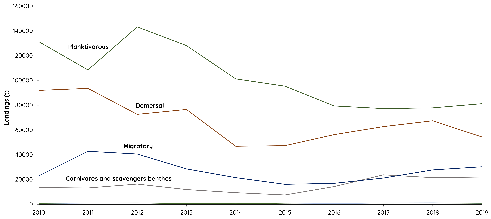
```

```{r landings_fleet, echo=FALSE, fig.cap="Guilds per fleet for the SBS StrathE2E model averaged 2010-2019 period", out.width = '100%'}
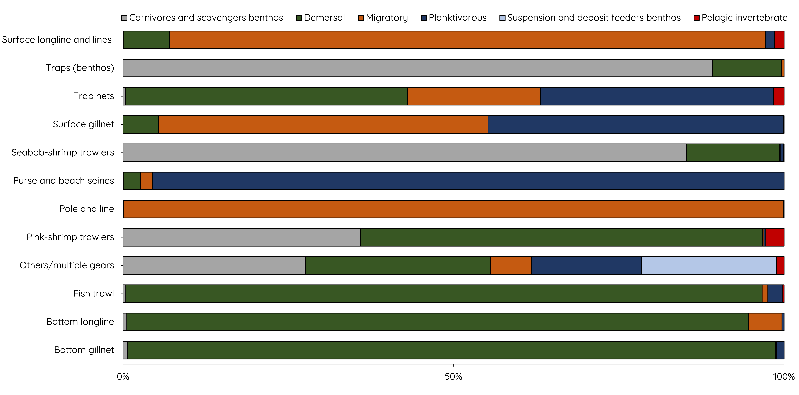
```

```{r type_cap}

tab_type_cap <- table_nums(name = "tab_type", 
    caption = "Aggregation of the fishing fleets for the SBS StrathE2E model")
```

`r table_nums("tab_type")`

```{r tab_type, fig.cap = tab_type_cap}

type_gear_tab <- data.frame(
  `Fleets StrathE2E SBS` = c("Traps (benthos)", "Pink-shrimp trawlers", "Seabob-shrimp trawlers", "Fish trawl", "Trap nets", "Purse and beach seines", "Bottom gillnet", "Surface gillnet", "Bottom longline", "Surface longline and lines", "Others/multiple gear", "Pole and line"),
  `Artisanal (%)` = c(53.89, 15.49, 88.32, 1.86, 69.09, 8.99, 41.48, 86.82, 40.20, 27.79, 88.12, 0.01),
  `Industrial (%)` = c(46.11, 84.51, 11.68, 98.14, 30.91, 91.01, 58.52, 13.18, 59.80, 72.21, 11.88, 99.99),
  check.names = FALSE
)

tab <- type_gear_tab %>%
  gt() %>%
  tab_options(
    table.font.size = 12,
    column_labels.font.weight = "bolder"
  ) %>%
  cols_align(
    align = "left"
  )

tab
```

## Discards {-}

The discards rates (proportion of catch discarded) per fleet and guild was obtained through literature review and available databases, described above for each fleet.

For Pink-shrimp and Fish-trawlers we utilized @cardoso21, who analyzed industrial bottom trawling fisheries in southern Brazil.
The discard biomass of commercially important Demersal species (*Cynoscion guatucupa*, *Macrodon atricauda*, *Micropogonias furnieri*, *Paralonchurus brasiliensis*, *Prionotus punctatus*, *Stephanolepis hispidus*, *Trichiurus lepturus* and *Umbrina canosai*) was aggregated and then divided by the total catch, resulting in a discard rate of 19.41% for this guild.
A comparable rate of 23.46% was identified by grouping demersal species in the @vianna05 study, reflecting the historical discard patterns of the SBS Pink-shrimp fleet.
In @cardoso18 approach, the discard rates of Double-rig and Pair-trawl fisheries off the coast of Rio Grande do Sul average 31% for the four main demersal species evaluated.
Due to the study's regional focus, we choose a more conservative estimate.

For Seabob-shrimp trawlers, we referenced @broadhurst16, who evaluated the discard of SBS artisanal gears targeting *Xiphopenaeus kroyeri*.
The teleost discard rate of 33.5% identified in their study was used as our Demersal guild rate.
This fleet discard rate usually ranges from 30-50% in the literature, with Perez et al. (2001) being a commonly referenced study reporting higher discard rates for small-scale trawlers and lower rates for industrial single trawls.
The seabob-shrimp fleet is appointed by @kelleher05 as a fleet with high discards rates due to the distance between the fishing grounds and the low demand of the discarded species.

In the three trawlers gears of the model, we use the discard rates of @keunecke07 for Crustaceans (4%, applied for CS Benthos guild) and non-target Cephalopods (18.4%, applied for CS Zooplankton guild) estimated for SBS Pink-shrimp trawling.
Few studies quantitatively addressed the benthos discarded by trawlers at SBS, although it is well-known that non-target crustaceans are abundant in these fleets and the actual discard rate may be higher than the ones include in the model (@branco04; @rodrigues20).

For the Bottom-gillnet fleet, we refer to the findings of @fogliarini17, who investigated the discard rates associated with bottom-gillnet targeting *M. furnieri* in southern Brazil.
@fogliarini17 reported an average discard rate of 20% for this specific target species and 6% for gillnets directed at demersal fishes.
Schroeder (2014) also conducted an assessment on the SBS bottom-gillnet targeting *M. furnieri*.
Their study revealed that, on average, 0.27 non-target organisms were discarded for every Whitemouth croaker captured, resulting in a discard rate of approximately 21.2%.
Considering that the Bottom-gillnet fleet targets a range of demersal species, we averaged the discard rates reported by @fogliarini17, resulting in a conservative estimate of 13% for this fleet.

For Surface Gillnet we applied the average discard rate of 18% reported by @fogliarini17.
This discard rate is primarily influenced by the discard of the Argentine menhaden (*Brevoortia pectinata*) and was applied to the Planktivorous guild.

We utilized the discards estimates from Schroeder et al. (2021) for the Brazilian sardine fisheries for the Purse and Beach-Seine fleet.
We categorized the species into the StrathE2E guilds, and calculated discard rates by dividing the discards by the total catch for each respective guild.
In the case of Demersal and Planktivorous species, we also incorporated the authors' estimate of overboard discards into our calculations.
We obtained a low discard rate of 4.75% for Demersal species, primarily attributed to *Dactylopterus volitans* and *M. furnieri*.
The Planktivorous guild exhibited a discard rate of 3.15%, predominantly associated with *Opisthonema oglinum*, *Mugil liza*, *Scomber colias*, and juveniles of *S. brasiliensis*.
Migratory species, on the other hand, had a higher discard rate of 41.03%, driven mainly by *K. pelamis* and elasmobranch species.
In the case of Carnivorous and scavengers benthos, we used the discard rate of *Octopus vulgaris* (41.97%).

Surface longlines and lines showed a discard rate of 14.7% for Demersal, given mainly by *Umbrina canosai* and Batoidea rays, and 3.95% for Migratory fishes given by small to large sharks.
Andrade (2012) estimated discards for part of the Brazilian fleet based in the Northeast coast, where the discards rates of sharks was low considering the entire catch (\<1%).
For the bottom longline we set 14.51% for Demersal, given the discards rates of *U. canosai*.
For Traps (benthos) we considered the small scale pots and traps of SAU, estimating a discard rate of 58.66% for the Demersal guild, given mainly by *M. ancylodon* and *M. furnieri*.
For Trap Nets, a more artisanal fleet, the discard is mainly given by catfishes of the family Ariidae (31.61% for Demersal).

For Other/multiple gears, we used a general discard estimate based on the FAO global database for multigear and multispecies and hand-collection fleets (Kelleher, 2005).
A discard rate of 0.3% was applied to each guild captured by the fleet.
We also used Kelleher (2005) estimate for Pole-and-line targeting tuna, with 0.4% discard applied to the migratory fish guild.

For the remaining fleets the discard rates were computed using @sau database filtered for the 2010-2019 period and allocating the species to StrathE2E guilds.
Guild-specific discard rates were derived by calculating discard ratios and applying the same rates to earlier provided landing values.

```{r dis_cap}

tab_dis_cap <- table_nums(name = "tab_discard", 
    caption = stringr::str_glue("Discards rates per fleet and guild applied in the baseline period implementation for the SBS model"))
```

`r table_nums("tab_discard")`

```{r discards_tab}

discards_tab <- data.frame(
  `Fleets StrathE2E SBS` = c("Traps (benthos)", "Pink-shrimp trawlers", "Seabob-shrimp trawlers", "Fish trawl", "Trap nets", "Purse and beach seines", "Bottom gillnet", "Surface gillnet", "Bottom longline" , "Surface longline and lines", "Others/multiple gear", "Pole and line"),
  `Planktivorous` = c("",	"",	"",	"",	"", 0.0315,	"", 0.1800,	"",	"",	"",	""),
  `Demersal` = c(0.5866,	0.1941,	0.3350, 0.1941, 0.3161, 0.0475, 0.1300,	"", 0.1451, 0.1470, 0.0030,	""),
  `Migratory` = c(	"",	"",	"",	"",	"", 0.2909,	"",	"",	"", 0.0395,	"", 0.0040),
  `CS Benthos` = c(	"",	0.0400,	0.0400, 0.0400,	"", 0.4197, 0.2220,	"",	"",	"", 0.0030,	""),
  `CS zooplankton` = c(0.1840,	0.1840,	0.1840,	"", 0.4297,	"",	"",	"",	"",	"",	"",	""),
  check.names = FALSE
)

tab <- discards_tab %>%
  gt() %>%
  tab_options(
    table.font.size = 11,
    column_labels.font.weight = "bolder",
  ) %>%
  cols_align(
    align = "center"
  )
tab

```

## Bycatch {-}

We conducted a bibliographic search to compile as many publications as possible on bycatch data for the top predator guilds: seabirds, pinnipeds, and cetaceans in the SBS.
Our goal was to include all states for each guild and to exclude overlapping studies (same study area and same species).
A total of 21 sources containing the relevant information were compiled.
However, for the final calculations, we prioritized studies with observational data rather than estimated data and with a study period of at least one year.
A detailed spreadsheet was created, including species information such as common and scientific names, guild, year, latitude, longitude, depth, discarded individuals, fishing days, fleet, and other relevant details.
This spreadsheet is available for consultation at: [link].
The average weight of species, accounting for gender and age if this information was available, was sourced from the literature to estimate the bycatch in tons.
The final unit was converted to mMN.mˆ-2ˆ.yˆ-1ˆ using the appropriate conversion factor (@greenstreet96, table X).

Note that the methodology developed here was a simplification, which is sufficient for the purposes of parameterizing the SBS StrathE2E2 model.
The annual bycatch data should not be regarded as a comprehensive study on this topic and are almost certainly underestimated, as we adopted a conservative methodology, prioritizing observational data.

Bycatch data were found for the following StrathE2E SBS fleets: Fish Trawl, Surface Gillnet, Bottom Gillnet, Surface Longline, and Other/Multiple Gears, as described below for each guild.

### Cetaceans {-}

For the cetacean guild, we utilized studies by @bertozzi02, @ott02, @secchi04, @perez05, @flach15, @fogliarini17, and @prado21 for bottom gillnets with bycatch data on the franciscana (*Pontoporia blainvillei*), Guiana dolphin (*Sotalia guianensis*), common dolphin (*Delphinus sp.*), and other dolphins of the genus Stenella.
Among the compiled studies, the highest bycatches were associated with bottom gillnet fishing targeting the monkfish (*Lophius gastrophysus*), occurring extensively in the offshore SBS @perez05.
Fishing targeting croaker, drum, and other demersal fish ranked second in estimated bycatch values @secchi04.
Cetacean bycatch was particularly concerning in gillnet fisheries, with the critically endangered franciscana dolphin highlighted, as reported by OCEANA (2024).

For surface gillnets, we referred to studies by @ott02, @secchi04, @mader06, @sidou08, @fruet10, @marigo10, @domiciano16, and @fogliarini17.
In addition to the dolphin species caught in bottom gillnets, surface gillnets also resulted in bycatch of bottlenose dolphins (*Tursiops truncatus*), Atlantic spotted, spinner, and striped dolphins (*Stenella frontalis*, *S. longirostris*, and *S. coeruleoalba*), pygmy killer whale (*Feresa attenuata*), melon-headed whale (*Peponocephala electra*), and long-finned pilot whales (*Globicephala melas*).
Surface gillnets targeting sharks, tuna, and mullets across the SBS contributed significantly to the annual bycatch.

The total cetaceans bycatch from both the gillnets fleets was estimated at 25.19 tons per year - 14.51 from surface and 10.68 from bottom gillnet.

### Seabirds {-}

For the seabird guild, we compiled sources of @perez05, @cardoso11, and @fogliarini17 for bottom gillnets, recording bycatch of the species: Magellanic penguin (*Spheniscus magellanicus*), and petrels (*Daption capense*, *Procellaria aequinoctialis*, *Puffinus griseus*, and *P. gravis*).
The fleet targeting monkfish was responsible for the major petrel bycatch, followed by fleets targeting croaker and other demersal fish, with incidental captures of penguins.

For surface gillnets, we used the sources of @cardoso11, @branco14, and @fogliarini17.
The anchovy fishery in Rio Grande do Sul yielded the highest seabird bycatch.
The incidental capture of Magellanic penguins in both surface and bottom gillnets is significant and considered the primary source of adult mortality in their wintering areas @fogliarini19.
In addition to the previously mentioned seabirds in gillnets, surface longlines and lines also recorded bycatch of other petrels (*Macronectes giganteus*, *Oceanites oceanicus*, *Puffinus puffinus*, and *Calonectris borealis*), and albatrosses (*Diomedea dabbenena* and *D. exulans*).
For surface longline and line data, we used sources such as @olmos01, @bugoni08a, @branco14, and @gianuca20.
Different fisheries targeting large pelagics fish were responsible for bycatch across the SBS offshore and overhang zones.
@gianuca20 observed that albatross and petrel bycatch in SBS fleets often involved birds that were accidentally caught, mutilated, or killed and discarded.
Bycatch in various longline fleets is widespread but largely undocumented, posing a significant threat to seabirds.
For bottom longlines, we referred to @neves06b, which reported low bycatch values for petrels.

This compilation resulted in a total seabird bycatch of 5.51 tons per year - 3.7 from surface longline and lines, 1.44 from bottom gillnet and 0.37 from surface gillnet.

### Pinnipeds {-}

Pinnipeds in the SBS occurs in the South region, in Rio Grande do Sul.
We used @machado15, which documented bycatch of the South American sea lion (*Otaria flavescens*) by the pair trawl fleet in this region.
@mader06 provided estimates of bycatch for *O. flavescens* and fur seals (*Arctocephalus australis* and *A. tropicalis*) in surface gillnets.
Unlike cetaceans and seabirds, the highest mortality of pinnipeds due to fishing does not occur onboard but through subsequent interactions with ghost nets @mader06.
We considered then an annual bycatch of 1.53 tons - 1.07 from surface gillnet and 0.46 from fish trawl.

## Fishing effort and distribution per habitat {-}

### Fishing effort {-}

Fishing effort data for each fleet are required as inputs to the model in terms of seconds of activity per mˆ2ˆ per day.
Although the SBS contains apparent annual fishing effort data from the National Fishing Vessel Tracking Program (PREPS) via the Global Fishing Watch (GFW) map interface, these data only records large industrial vessels and do not align with the fleets defined for the StrathE2E SBS model.
Therefore, we used fishing days data from state-specific monitoring programs, later converting them to fishing hours.
The steps taken to reach the final unit are described below.

#### Step 1. Data Compilation {-}

The first step was to compile fishing days data from the consolidated PMAP reports, categorized into industrial and artisanal fleets.
The data were compiled for each semester by state and year, covering the period from 2017 to 2019 for the SBS states: São Paulo, Santa Catarina, Paraná, and Rio de Janeiro.
Data for Rio Grande do Sul were extracted from the FURG/CEERMA reports for 2018 and 2019.
In this case, the average duration of fishing trips in days was multiplied by the total landings to estimate fishing days.

#### Step 2. Fleet Allocation {-}

The gears reported in the PMAP reports were allocated in the 12 fleets defined for the StrathE2E SBS model based on their operational similarities and target species (see Table X).
Unidentified fishing activities were not considered.
For the gillnet fleet, there was no distinction between surface and bottom gillnets.
Therefore, a separation into surface and bottom categories was made by applying the same capture proportion for each fleet.
Although there is a division between bottom and surface longlines, there are also significant values in longlines not identified.
The same procedure used for gillnets was applied, using the proportion of landings from bottom and surface longlines to allocate into each fleet.

#### Step 3. Missing Data {-}

Data for Rio de Janeiro state were only available from 2018 onward, creating a discrepancy for the year 2017.
To address this, the fishing days for each semester of 2017 were estimated to correspond to 2018 values for the and fleet.
Data for each fleet in RS in 2017 were also missing and was assumed to be the same as the 2018 values.

#### Step 4. Conversion to Fishing Hours {-}

To convert fishing days into fishing hours, we used an average value of daily operational hours for each fleet.
Assumptions guided daily effort estimates: 14h for Fish trawl, 16h for Pink-shrimp trawl, 18h for Purse-seine and beach seines, 10h for Pole-and-line, and 12h for other fleets.
These were then converted into seconds of activity per m² per day for each fleet (tab. X).

```{r effort_cap}

tab_effort_cap <- table_nums(name = "tab_effort", 
    caption = stringr::str_glue("Effort etc e tal."))
```

`r table_nums("tab_effort")`

```{r effort_tab}

effort_table <- data.frame(
  Fleets = c("Traps (benthos)", "Pink-shrimp trawlers", "Seabob-shrimp trawlers", "Fish trawl", "Trap nets", 
             "Purse and beach seines", "Bottom gillnet", "Surface gillnet", "Bottom longline", 
             "Surface longline and lines", "Others/multiple gear", "Pole and line"),
  `Daily fishing hours` = c(12, 16, 12, 14, 12, 18, 12, 12, 12, 12, 12, 10),
  `Effort (s.year-1)` = c("3.34E+09", "1.87E+10", "3.89E+10", "5.17E+09", "6.49E+09", "7.37E+09", "8.49E+10", 
                          "3.02E+10", "5.28E+08", "5.59E+09", "1.91E+10", "2.01E+08"),
  `Effort (s.m2-1.day-1)` = c("2.93E-05", "1.99E-04", "3.41E-04", "1.53E-05", "5.70E-05", 
                              "6.48E-05", "7.46E-04", "2.65E-04", "4.64E-06", "4.92E-05", 
                              "1.68E-04", "1.47E-06"),
  `Plough rate (m2.s-1)` = c(0, 35, 35, 35, 0, 0, 1.55, 0, 0.89, 0, 0, 0),
  check.names = FALSE
)

effort_tab <- effort_table %>%
  gt() %>%
  tab_options(
    table.font.size = 11,
    column_labels.font.weight = "bolder"
  ) %>%
  cols_align(
    align = "center"
  ) %>%
  cols_label(
    Fleets = "Fleets StrathE2E SBS",
    `Daily fishing hours` = "Daily fishing hours",
    `Effort (s.year-1)` = html("Effort (s.year<sup>-1</sup>)"),
    `Effort (s.m2-1.day-1)` = html("Effort (s.m<sup>2</sup>.day<sup>-1</sup>)"),
    `Plough rate (m2.s-1)` = html("Plough rate (m<sup>2</sup>.s<sup>-1</sup>)")
  )

effort_tab
```

### Fleet Distribution per habitat {-}

Fleet distribution in each habitat was allocated by combining information from PMAP reports with the sediment habitats.
Maps and associated text, often specifying the locations and isobaths with the most fishing activity, was used to allocate the fleets in each habitat, assisted by georeferenced sediment habitats.

## Seabed abrasion {-}

To calculate the seabed abrasion rate (plough rate) per unit of time for each fleet, we used the study by Costa et al. (2024), which evaluated the pressures exerted by demersal fisheries during 2018 in Southeast and South Brazil.
We multiplied the average fishing days by the total trips in the period and used the same conversion of hours per fishing day considered in the study.
Thus, we obtained the total disturbed area (mˆ2ˆ) per seconds of fishing activity for three different gears: trawlers, gillnet, and bottom longline.
Given that the trawlers fleets considered in the present model are a mix of the fleets from Costa et al. (2024), we assumed an average plough rate of 35 m/s for our three trawlers fleets.

We assumed a gear penetration depth of 2.5 cm across all seabed-contact gears, independent of sediment type, based on the average penetration of otter trawl and beam trawl reported by Hiddink et al. (2017).
We used a depletion fraction (damage mortality rates on benthic species caused by seabed-contact towed gears) of 0.10, following the same study.

## Other processing {-}

1.  Total catch by fleet and guild was calculated by inflating landings with discard/bycatch values (described above for cetaceans, birds, planktivores, migratory and demersal fish).

2.  Discarded weight was calculated as catch - landings.

3.  When catch was 0 discard rates were set to 1.

4.  Fishing power was calculated as catch / activity per fleet.

# Target data {-}

Observed (target) data is used in the fitting process to train StrathE2E to return sensible values during the simulated annealing scheme (see the methodology implemented in StrathE2E in X and Y).
Ecosystem state indices included in the optimisation process are data regarding the gross and net production of commercial guilds, PB ratios, fishery landings, bycatch, and other properties, located in the file "annual_observed_SBS.csv".

To optimize fishing gear activity rates we used target data concerning the harvest ratios (the proportion of exploitable biomass captured per day within each guild), fitting a scaling parameter for the effort-to-harvest ratio.
The resultant values can be found in the files "region_harvest_SBS.csv" and "zonal_harvest_r_SBS.csv".

## Production and PB ratios {-}

Calculating the production of all six commercial guilds in the SBS involved compiling and adjusting biomass data and PB ratios for the main species of each guild, including both commercial species present in our fisheries database and non-commercial species of ecological importance in the region.
Subsequently, we convert the biomass for each species into gross production using PB ratios and converted them to molar nitrogen mass following @greenstreet96.
The PB ratios sourced was also used as target data.
For seabirds, cetaceans, and pinnipeds, net production was calculated using the relationship net production = 0.6 \* gross production.

We compiled biomass data and PB ratios for the main species of each guild, including both commercial species present in our fisheries database and non-commercial species of ecological importance in the region.
In our literature search, we encountered a limited number of recent studies quantifying the biomass of commercial species in the SBS.
Although Cardoso et al. (2022) conducted recent stock assessment estimates, the authors have not released the associated biomass data, as it has not been published to this date.
Our primary data source comprises the stock assessments from Sea Around Us, which biomass data per species based on CMSY analysis (Pauly et al., 2020; for the methodology, refer to www.seaaroundus.org/cmsy-method).
A range of other ecosystems models were also used, with special care taken to use values from similar systems, species, and genera.
The PB ratios were obtained from mortality values found in the literature or the ones generated by other ecosystem models.

Details regarding the sources of biomass and PB ratios, along with the calculated values, are available in `r table.ref("production_tab")`.
The compilation conducted for each guild is described below.

```{r production_cap}

tab_production_cap <- table_nums(name = "production_tab",
    caption = "P/B ratios utilized to estimate production as target data for each commercial guild in the model. Production values are presented in tonnes. The mMN conversion indicates the values used to convert the gross and net production from grams to molar nitrogen mass, using @greenstreet96. The final production is presented in units of millimoles of nitrogen per m^2^.")
  
```

`r table_nums("production_tab")`

```{r production_tab}

library(dplyr)
library(gt)

production_tab <- data.frame(
  Guild = c("Seabirds", "Cetaceans", "Pinnipeds", "Migratory", "Demersal", "Planktivorous", "Carnivorous and scavengers benthos", "Suspension and deposit feeders benthos", "Omnivorous zooplankton", "Carnivorous zooplankton"),
  `P/B` = c(0.140,	0.050,	1.040,	0.940,	0.970,	1.560,	4.100,	4.870,	90.000,	5.150),
  `Production(t)` = c(130.93, 1839.45, 167.27, 584782.64, 805060.55, 3111562.33, 11040536.07, 36450985.87, 165103686.00, 3633193.62),
  `mMN convertion` = c(2.5157,	2.5157,	2.5157,	2.3145,	1.2956,	2.0377,	1.0063,	0.5031,	0.5031,	1.2579),
  `Production (mMN.m-2)` = c("0.0006", "0.0089", "0.0008",	4.3417,	3.3459,	20.3396,	35.6394,	"58.8328",	666.2034,	14.6601),
  check.names = F
)

tab <- production_tab %>%
  gt() %>%
  fmt_number(
    columns = vars(`P/B`, `mMN convertion`),
    decimals = 3,
    use_seps = FALSE
  ) %>%
  fmt_number(
    columns = vars(`Production(t)`, `Production (mMN.m-2)`),
    decimals = 1,
    use_seps = FALSE
  ) %>%
  tab_options(
    table.font.size = 11,
    column_labels.font.weight = "bolder",
  ) %>%
  cols_align(
    align = "center"
  ) %>%
  cols_label(
    Guild = "Guild",
    `P/B` = "P/B",
    `Production(t)` = "Production(t)",
    `mMN convertion` = "mMN convertion",
    `Production (mMN.m-2)` = html("Production (mMN.m<sup>-2</sup>)")
  )
tab
```

### Top-predators {-}

#### Seabirds {-}

The majority of seabirds in the SBS belong to the Orders Procellariiformes, including albatrosses and petrels, followed by Charadriiformes (gulls, skuas, and terns), Pelecaniformes (frigates and boobies), and Sphenisciformes, which includes penguins (Neves et al., 2007).
Population size studies in the region are scarce, often focusing on specific seasons or small areas of the SBS.
We uilized the output parameters of the @gasalla04 Ecopath model, which estimated a biomass of 0.001 t.kmˆ-2ˆ for resident seabird species such as *Sula leucogaster*, *Sterna eurygnatha*, *Larus dominicanus*, *S. hirundinacea*, and *Fregata magnificens*, based on population censuses and literature-based abundance.
We applied this ratio to our area and utilised the PB ratio of 0.14 from the same source.

### Cetaceans {-}

For the Cetaceans guild we utilised the density and abundance estimates from the Cetacean Monitoring Project in the Santos Basin (Projeto de Monitoramento de Cetáceos na Bacia de Santos - PMC-BS) (Petrobras, 2021) based on both onboard and aerial monitoring conducted over five years of effort.
General data were available for mysticetes and delphinids, as well as specific data for three species with sufficient sample sizes: the humpback whale (*Megaptera novaeangliae*), Atlantic spotted dolphin (*Stenella frontalis*), and bottlenose dolphin (*Tursiops truncatus*).

The study area of the PMC-BS encompasses a significant portion of the SBS, extending from Cabo Frio-RJ to Florianópolis-SC and down to 2000 m depth.
Although the covered isobath surpasses the domain of the present model, it is noted that most species are found in the shelf region rather than the oceanic region.
The humpback whale is a species that can be found at greater depths; however, the average sighting depth was approximately 420 m, indicating that the estimated density can be attributed to the SBS region considered in this StrathE2E baseline model.
We used data from campaigns 1 to 9, representing data collected between 2015 (PMC-BS start year) and 2019 (the end year of the StrathE2E SBS baseline period), and averaged the number of individuals per km² for this period and for both aerial and overboard monitoring methods.
We then compiled the average weight of the main cetacean species in the region using the average weight of females and males as reported in Christensen (2004).
The number of individuals was multiplied by the average weight to obtain the biomass per km².
Subsequently, we multiplied this by our study area (311,733 km²), which is slightly larger than that of PMC-BS, as it includes the state of Rio Grande do Sul.
We assumed cetacean abundance to be consistent throughout the southern SBS, given that the same species persist across the entire area.

To estimate the weight of "Other Mysticeti," we utilized the average weight of Bryde's whale (*Balaenoptera brydei*) due to its significant presence in the region as reported in the PMC report.
This species is also the only large whale observed in Brazilian waters year-round.
Additionally, other whale species recorded in the report as present in the SBS include *Eubalaena australis*, *Balaenoptera acutorostrata*, *B. bonaerensis*, *B. borealis*, and *B. physalus*.
For the weight of "Other Delphinidae," we used the average weight of the primary delphinid species in the region: *Delphinus delphis*, *Feresa attenuata*, *Globicephala macrorhynchus*, *Grampus griseus*, *Sotalia guianensis*, *Stenella attenuata*, *S. clymene*, *S. longirostris*, and *Steno bredanensis*.
We also used the specific weights of *M. novaeangliae*, *S. frontalis*, and *T. truncatus* and their respective abundances for the biomass calculation.

We estimated an annual biomass of 0.12 t/km², totaling 36,788.93 tons.
We also utilised the PB ratio (0.050) from Gasalla and Rossi-Wongtschowski (2004), encompassing the species *Sotalia fluviensis*, *Steno bredanensis*, *Pontoporia fluviatilis*, *Balaenoptera edeni*, *Stenella frontalis*, and *Tursiops truncatus*.

```{r cetaceans, echo=FALSE, fig.align='center', fig.cap="Two cetaceans species inclued in the Cetaceans guild in the SBS model: Humpback whale (above) and Atlantic spotted dolphin (below). Illustrations by NOAA Fisheries and Dawn Witherington.", out.width = '70%'}
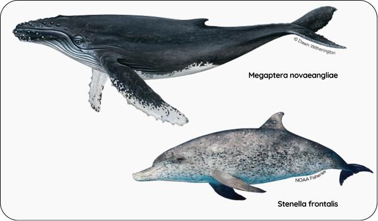
```

### Pinnipeds {-}

Regarding pinnipeds, the sea lions *Otaria flavescens*, *Arctocephalus australis*, and *Arctocephalus tropicalis* are the most abundant species in Brazil, predominantly inhabiting the Rio Grande do Sul region (Santos et al., 2012; Silva, 2004).
The only nearby ecosystem models with biomass estimates found were those by Bergamino et al. (2012), who estimated O.
flavescens biomass at 0.018 t.kmˆ2ˆ in the Rio de la Plata estuary and adjacent oceanic areas, and Reinaldo et al. (2016), who evaluated *O. flavescens* and *A. australis* at 0.021 t.kmˆ2ˆ on the Patagonian shelf.
Despite the lack of studies evaluating pinnipeds biomass in SBS, it is expected that a portion of these populations enters the model for feeding and resting.
@silva04 provides population estimates of *O. flavescens* and *A. australis* in the two Brazilian pinniped refuges, at 455 and 277 individuals, respectively.
The average weights of each species were used to estimate our model biomass.
Due to the lack of information regarding the population size of *A. tropicalis* in Brazil, its population was considered equivalent to that of *A. australis* and added to the total biomass of the guild.
The PB ratio used was 1.04, as reported by Reinaldo et al. (2016).

### Demersal fish {-}

The biomass of the demersal guild in the SBS was estimated using a range of sources for the main species in the region, which included 39 taxa with one or more species.
Among the sources used are the outputs parameters of Ecopath models by @gasalla04, @gasalla07, and @bornatowski18, adjusting the area when necessary if the species is predominant in a specific zone of the model; Haimovici et al. (2009) bottom trawl surveys from the REVIZEE cruise, and Sea Around Us stock assessments (averaged from 2010-2018 or the last year available).
For the SAU stock assessments, we ensured that the marine ecoregion matched the SBS, and in cases where it covered a broader region (e.g., the entire Brazil EEZ), we adjusted the biomass using the catch ratios of the broader region compared to our catches.
Local stock assessments are rare but we include those by Pio (2015) and Sant'Ana and Perez (2016).
As a result, we estimated an annual demersal fish biomass of 3.30 t.km-², or a total of 1,029,853 tons, in the SBS.
More details about the considerations for the main species are provided below.

The major commercial demersal fishes (constituting over 80% of our landings) comprise the species *Micropogonias furnieri*, *Umbrina canosai*, *Urophycis spp.*, *Cynoscion guatucupa* and *C. jamaicensis*, *Prionotus punctatus*, *Trichiurus lepturus*, *Paralichthys spp.*, *Merluccius hubbsi*, *Macrodon atricauda*, and *M. ancylodon*.

For the Whitemouth croaker (*M. furnieri*), the most caught demersal species, we derived the biomass estimated from Pio (2015), summing the Southeast and South stocks for the average 2010-2012, which resulted in approximately 118,000 tons.
Due to the lack of available P/B values in the literature, the most recent total mortality (Z) of 0.6 from Haimovici et al. (2021) was used.

The Argentine croaker *U. canosai*, another commonly caught species, was assessed by SAU using Haimovici and Cardoso (2017) as the source for relative biomass.
The most recent Z estimate of 0.86 from Haimovici et al. (2022) was used.
Other exploited sciaenid species include the weakfishes *C. guatucupa*, *C. jamaicensis*, *M. atricauda*, and *M. ancylodon*, which have economic and ecological contributions in the SBS.
Rough estimates for each species were made considering the ratio between reported biomass and catches in the SAU and our catch.
PB values from other ecosystem models (Gasalla and Rossi-Wongtschowski, 2004) for the sciaenids group were used.

The mullet (*Mugil liza*) is considered heavily overfished according to both SAU and OCEANA assessments. We used the biomass from the stock assessment for 2015 by Sant’Ana & Kinas (2016), which remained almost constant until 2019 (UNIVALI, 2020), and points that the mullet stock is overfished and experiencing overfishing.
The PB used was from Gabin et al. (2014) total mortality Z.

The hake (*Merluccius hubbsi*), cutlassfish (*Trichiurus lepturus*), and Brazilian codling (*Urophycis spp.*) are highly abundant species in the offshore and overhang zones of the model (Haimovici et al., 2008). These species hold commercial importance and are considered overfished (B<Bmsy), as indicated by Cardoso et al. (2022). Their biomass estimates and for the remaining major commercial species were sourced from ecosystem models by @gasalla07, @bornatowski18, and bottom trawl data from the REVIZEE cruises (Haimovici et al., 2008). The "Other demersal fishes" group in the @gasalla07 model encompasses approximately 20 species recorded in bottom trawl surveys (Haimovici et al., 2006), all of which show high biomass levels.

For non-commercial species, deep-ocean bentho-pelagic fish characterised as demersal were included, also exhibiting substantial biomass (e.g., *Caelorinchus marinii*, *Xenolepidichthys dalgleishi* from @bornatowski18). PB values for these species were derived from the same source. Boarfish (*Antigonia capros*) and rosefish (*Helicolenus spp.*) biomass, along with their PB values, were taken from the @gasalla07 model. Additionally, the silvery John dory (*Zenopsis conchifer*) was considered based on REVIZEE bottom trawl surveys conducted off southern Brazil (Haimovici et al., 2009), with PB values sourced from Nascimento et al. (2010).

The PB value of 0.76 was used as well as target data, based on the average PB of the key species/groups that account for 95% of the biomass, with the SD value of 0.47.

### Planktivorous fish {-}

Recent assessments of planktivorous fish biomass are limited in the literature. For the purpose of model parameterization, the biomass of the planktivorous guild in the SBS was estimated using a variety of sources, including other models and hydroacoustic surveys for key SBS species. We considered an annual biomass of 9.67 t/km², totaling 3,013,479 tons, which included 16 taxa representing one or more species. Further details regarding the main species are provided below.

In the compiled fisheries data, the Brazilian sardine (*Sardinella brasiliensis*) was the most caught species, even when considering all catches from the SBS StrathE2E guilds.  Despite several advances in the knowledge of this species over recent years, there are no recent official biomass estimates, and is considered "Data Deficient" by the International Union for the Conservation of Nature (IUCN) (Di Dario, 2018). We applied a biomass value of 3.55 t/km², as reported by Soares (2021), which was derived from unpublished data by the Scientific Committee (2021), to our study area. The Atlantic thread herring (*Opisthonema oglinum*) ranks as the second most frequently caught species, and we derived a rough estimate based on the ratio between reported biomass and catches in the SAU for Brazil's EEZ, adjusting for our SBS catches. The PB ratio for both species was obtained from Bornatowski et al. (2017) under the "Engraulidae and Clupeidae" group. The planktivorous biomass also includes other forage fish species such as *Bregmaceros atlanticus*, *Bregmaceros cantori*, *Scomber spp.*, jacks (*Caranx spp.*), and other Engraulidae and Clupeidae species. Biomass estimates for these taxa were derived from @sau, @gasalla07, Haimovici et al. (2008), or in the last case, estimated based on the proportion of biomass to catch of ecologically similar species. PB values were sourced from @gasalla04, @gasalla07, and @bornatowski18.

Among non-commercial species, the argentine anchovy (*Engraulis anchoita*) represents a significant stock shared with Uruguay and Argentina (Vaz-dos-Santos et al., 2007). In the SBS, its commercial exploitation is minimal, and the species exhibits a high capacity to replenish its biomass, a typical characteristic of small pelagics (Cooke and Madureira, 2012). For this species, we used biomass data from Cooke and Madureira (2012) and the PB ratio from Bornatowski et al. (2017). The mesopelagic pearlside (*Maurolicus stehmanni*) also contributes substantially to SBS fish biomass, being particularly abundant on the outer shelf and continental slope (Madureira and Rossi-Wongtschowski, 2005; Rodrigues-Ribeiro et al., 2021).  As a forage species with a short life span, rapid growth, and a dietary preference for zooplankton, *M. stehmanni* was classified here within the planktivorous guild (Ribeiro, 1996; Almeida, 2001). Although not directly targeted by fisheries, it plays a crucial trophic role, serving as prey for tuna, squid, and demersal fish (@bornatowski18). We applied biomass values from @gasalla07 from their Ecopath model for the SBS region between 100 and 1000m, which were based on hydroacoustic surveys conducted by Madureira et al. (2005). Additionally, we included biomass estimates and PB values for other planktivorous mesopelagic species, including 18 species from the @gasalla07 model, with 61% of the biomass in this group comprising other Myctophidae species.

The PB value of 1.36 and SD 0.28 was used as well as target data, based on the average PB of the key species/groups that account for 95% of the biomass: *S. brasiliensis*, *E. anchoita*, *M. stehmanni*, along with the groups classified as other forage species and other mesopelagic planktivores. 

### Carnivorous and scavengers benthos {-}

We aggregated biomass data for commercial and non-commercial species within the CS Benthos guild, noting that non-commercial species exhibited the highest densities.
Among the commercial species, the shrimps *Xiphopenaeus kroyeri*, *Farfantepenaeus spp.*, *Artemesia longinaris*, *Pleoticus muelleri*, and *Litopenaeus schmitti* are the most important, comprising 71.7% of the guild's landings.
The biomass of the pink shrimp *Farfantepenaeus paulensis* *Farfantepenaeus subtilis*.
was available for the SBS from the @sau assessments for 2010-2018.
For the other shrimp species, we made a rough estimate by considering the ratio between reported biomass and catches in the @sau for the Brazilian EEZ, compared to our SBS catches for the 2010-2018 average.
The PB values for both species were derived from @gasalla04.

Crabs are also significantly caught in the SBS.
As we did not found studies evaluating the biomass of individual crab species in the region, we used the biomass values from the model by Nascimento et al. (2010), which derives from the REVIZEE cruises prospection (Amaral and Rossi-Wongtschowski, 2004) and includes various species of commercial and non-commercial crabs (e.g., *Chaceon spp.*, *Portunus spp.*, *Euprognatha sp.*, *Scyllarides deceptor*, among others).

Two main species of lobsters occur in the region, *Metanephrops rubellus* and *Panulirus argus*.
The biomass of *P. argus* was roughly assumed to be the same as that from Eastern Brazil in the SAU stock assessment for the 2010-2018 average.
No biomass assessments for *M. rubellus* were found up to the date of this study.
For model parameterization purposes, we made a rough estimation using the biomass and catch of *Panulirus argus* applied to our SBS *M. rubellus* catches.

Octopuses from the family Octopodidae are significantly captured in the SBS, with *Octopus vulgaris* being the most abundant species along the SBS coast (0--100 m depth) (Haimovici et al., 2009).
In the absence of specific biomass estimates for octopuses, we used the biomass and PB values from the "Predator molluscs" group in the Nascimento et al. (2010) ecosystem model, which includes octopuses along with many other noncommercial CS benthic species.
The same source was used for the biomass and PB values of predator crustaceans (*Hemisquilla brasiliensis*, *Squilla* sp.), predator invertebrates (Stomatopoda, *Astropecten* sp., *Atorella* sp., *Nausithoe* sp.), deep-sea shrimp (*Alpheus* spp., *Heterocarpus* spp., *Rhynchocinetes* spp., *Acanthephyra* spp., *Aristaeopsis edwardsiana*, among others), and omnivorous invertebrates (Isopoda, Amphipoda, Chaetognatha).

This resulted in a biomass for the CS benthos guild of 8.98 t.km-², totaling 2,797,960.44 tons. The PB value of 3.51 and SD 2.44 was used as well as target data, based on the average PB of the key species/groups that account for >95% of the biomass.

### Suspension and deposit benthos {-}

The most important commercial species in the SD guild are the oyster *Crassostrea rhizophorae* and the mussel *Perna perna*, accounting for 69.7% of our landings.
For both species, we used the biomass from the SAU stock assessment for the SBS region from the 2010-2018 average.
Non-commercial SD benthos comprise most of the guild's biomass.
We used the biomass of Polychaeta, Infauna, Detritivorous invertebrates, and Bivalves from the Nascimento et al. (2010) ecosystem model, derived from the Amaral and Rossi-Wongtschowski (2004) REVIZEE cruises, and the PB values for each group from the same source.

This resulted in a biomass for the SD benthos guild of 31.68 t.km-², or 9,875,197.3 tonnes.
The PB value of 5.8 was used as well as target data, based on the average PB of the key species/groups that account for 95% of the biomass, and the SD value of 6.09.

### Carnivorous and scavengers zooplankton {-}

For the carnivorous zooplankton guild, we considered squids and gelatinous zooplankton as primary representatives.
Haimovici et al. (2008) provided a survey of the biomass of the squid *Loligo plei* on the outer shelf, covering depths of 100-600 m.
However, caution was advised as the surveys did not include the inner shelf, where most of this species' biomass is found (Perez, 2002).
To include squids on the inner shelf, we utilized *Loligo spp.* biomass data of 5.28 t/km² from @gasalla04, scaled by the study area.
PB values were sourced from Vera (2010).
We also considered the biomass and PB values of the Argentine shortfin squid (*Illex argentinus*) from @gasalla07, an abundant species found at greater depths.

Regarding planktonic cnidarians, over 300 species are documented in the SBS (Miodeli, 2011), with species like the scyphomedusae *Lychnorhiza lucerna* exhibiting substantial biomass in shallow coastal areas (Nogueira Júnior and Haddad, 2017).
However, gelatinous zooplankton remains one of the least studied groups in Brazil (Lopes, 2007).
The latest quantitative assessment of gelatinous zooplankton biomass was conducted by Nogueira-Junior et al. (2010), focusing on the Macromedusae biomass of Hydrozoa, Cubozoa, and Scyphozoa.
We extrapolated total biomass data, originally sampled in Florianopolis and converted into tonnes, to cover the entire SBS area by dividing it by the netting route area (km²).
Given the lack of local data, we applied the PB ratio for jellyfish from the World's Large Marine Ecosystems Ecopath model (Christensen et al., 2014).

The PB value of 5.15 was used as well as target data, based on the average PB of the aforementioned species, with SD value of 4.27.

### Omnivorous zooplankton {-}

No public databases of zooplankton biomass were identified for significant resolution of the SBS region, which is largely unstudied, particularly for certain taxa (Nogueira and Brandini, 2018).
Recent studies have been conducted over short durations, primarily concentrating on estuarine and coastal areas, such as Santos (Miyashita et al., 2009), Ubatuba (Melo-Junior et al., 2016), and Cabo Frio (Dias et al., 2015).
Nogueira and Brandini (2018) highlighted the presence of nearly 800 zooplanktonic invertebrate species within the SBS and the higher zooplankton biomass in coastal areas.
Herbivorous copepods comprise the majority of the zooplankton community on the shelf and represent a direct link to fishery food webs (Brandini et al., 1997; Lopes et al., 2006).

Melo-Junior et al. (2016), when studying the copepod community off Ubatuba, pointed out that the dominant copepods were immature copepodids and small adults of species belonging to the genera Oncaea, Temora, Paracalanus, Clausocalanus, Oithona, and Onychocorycaeus, a pattern that can be representative of the entire SBS The integrated average biomass for the water column was 18.39 mg.mˆ-3ˆ, which converted by wet weight and using the local depth of 40 m results in 3,679 g/m².
In the Miyashita et al. (2009) study for the Santos estuarine inner shelf, the average copepod biomass was 4.17 g.mˆ-2ˆ (converted by wet weight and using the local depth of 50 m), and was higher in the summer.

In the absence of a comprehensive study covering the entire SBS, we opted to use biomass and PB data from modeling conducted by @gasalla04 and @gasalla07.
Given the consistent SBS zooplankton inshore-offshore gradient, and considering that @gasalla04 study area extends to coastal waters up to 100 m, we multiplied their reported biomass of 10.5 t.kmˆ-2ˆ by the area of their study model (97000 kmˆ2ˆ).
Additionally, we applied the biomass figure of 3.8 t.kmˆ-2ˆ from @gasalla07, covering depths from 100 to 1000 m, to the remaining area of our model (214733 kmˆ2ˆ).
@gasalla04 specify that the zooplankton biomass includes copepods, cladocera, chaetognatha, appendicularia, sergestids, luciferids, and salps.
Thus, combining the findings from both studies, we arrived at a final estimate of 5.88  t.km-² for our domain, allocated to the Omnivorous Zooplankton guild.

## Diet proportions {-}

We reviewed the dietary preferences of the main seabirds, cetaceans and pinnipeds species occurring in the SBS (see Section X). The dietary proportions identified were subsequently utilised as target data for the fitting process. We then calibrated the resource-consumer matrix of the model using a simulated annealing scheme to align the 2010-2019 model with observed ecosystem state data.

### Seabirds {-}

Across the studies reviewed, demersal fish is reported as the dominant component of seabird diets in the SBS, generally accounting for over 50% of the prey consumed, followed by small pelagic fishes, cephalopods and/or bivalves. For instance, Branco et al. (2005) found that demersal fish, primarily Sciaenidae, comprised 50% of the diet of *Sula leucogaster*, followed by benthic species such as shrimp with 26.5%, and small pelagic fish like sardines (Clupeidae and Engraulidae) accounting for 23.5%. Similarly, Mancini et al. (2023) reported that demersal species comprised 54.4% of S. leucogaster's diet, while small pelagic fish contributed 42.6%. The diet of *Larus dominicanus* in Paraná, as studied by Miotto et al. (2017), was also dominated by demersal species, with *Paralonchurus brasiliensis* and *Stellifer rastrifer* together accounting for more than 79% of the diet. In Silva-Costa and Bugoni (2013), small demersal fish were the primary prey for *Larus dominicanus*, followed by bivalves. Bugoni and Vooren (2004) highlighted the importance of demersal fish for *Sterna hirundo* during the winter in Rio Grande do Sul, constituting 93% by mass. Likewise, Oliveira et al. (2019) found that the diet of *Nannopterum brasilianus* in Rio Grande do Sul primarily consisted of demersal fish, with occasional consumption of the squid *Doryteuthis plei*. Colabuono and Vooren (2006) also found that demersal fish were significant for albatross species (*Thalassarche spp*.), comprising 47.2% to 100% of their diet, though the diet of petrels (*Procellaria spp.*) was predominantly cephalopods (77.3–95.9%).

Numerous studies across the SBS indicate that the prevalence of demersal fish in the diet of seabirds is closely related to fishery discards, particularly from trawl fisheries (Bugoni and Vooren, 2004; Colabuono and Vooren, 2006; Traversi and Vooren, 2010; Carniel and Krul, 2012; Silva-Costa and Bugoni, 2013; Miotto et al., 2017). Carniel and Krul (2012) observed that 90.3% of seabird interactions with fishing operations involved feeding on trawling discards. Colabuono and Vooren (2006) reported that 40% of the fish consumed by seabirds were derived from fishery discards, most of which were juvenile demersal individuals below the marketable size and a large proportion of trawling bycatch. Similarly, Branco (2001) found that in Santa Catarina, discards from seabob shrimp fisheries—mostly small demersal fish—accounted for 84% of the diet of seabirds. Similarly, Traversi and Vooren (2009) found that 80% of the total prey mass consumed by *Sterna hirundo* came from demersal fish discards.

Based on the dietary proportions reported in these studies, we assumed that fishery discards account for 50% of the seabird diet, with 30% composed of other demersal fish, 10% of planktivorous fish, 2% migratory fish, and the remaining 8% distributed among squids, CS benthos, and other prey groups ((`r table.ref("diet_tab")`). These proportions were integrated into the target data for our model to better simulate seabird feeding behaviours and interactions with the SBS ecosystem.

### Cetaceans {-}

We focused on dolphins diets, as Mysticeti (i.g. humpback whales), do not typically feed during their breeding season or migrations through the SBS. Santos et al. (2002) found that squids was the main prey in the common dolphin (*Delphinus capensis*) and bottlenose dolphin (*Tursiops truncatus*), followed by demersal sciaenid fish, particularly *Stellifer rastrifer*, and shrimps. Similarly, Bassoi et al. (2020) observed that franciscana dolphins (*Pontoporia blainvillei*) in southern Brazil primarily consumed the squid *Loligo sanpaulensis* and demersal fish species such as *Cynoscion guatucupa*. The diet of Guiana dolphins (*Sotalia guianensis*) is also composed of sciaenid fishes such as *Paralonchurus brasiliensis*, and the squid *Doryteuthis plei* (Lopes et al., 2012). Aggregating diet data from Lopes et al. (2012) into the StrathE2E guilds, we find that cephalopods (*Doryteuthis plei* and *Loliguncula brevis*) contributed 36.7% to the diet, while demersal fish (e.g., Sciaenidae, Trichiuridae, Mugilidae) 30.55%, and planktivorous fish (Clupeidae, Engraulidae) represented 32.7%.

In the case of franciscana dolphins (Pontoporia blainvillei), Campos et al. (2020) reported that their diet is dominated by the planktivorous fish *Pellona haroweri*, besides squid (*Doryteuthis plei*) and demersal fish (*Isopisthus parvipinnis*), showing a preference for both pelagic and demersal prey. Henning et al. (2018) further supported these findings, noting that the most important species in the diet of franciscana dolphins were *P. harroweri*, *D. plei*, *P. brasiliensis*, and *I. parvipinnis*, with planktivorous prey comprising 34.92%, cephalopods 37.3%, and demersal fish 39.14%. Melo et al. (2009) examined the feeding habits of six delphinid species, were cephalopods—particularly the squid *Loligo plei*—comprised 71.4% of the total prey, while teleosts 28.6%. 

The feeding preference for cephalopods and demersal fish, with a smaller proportion of pelagic fish and CS benthos for some species, was consistently noted across the cetacean species in the reviewed studies. Based on the reported data, we assumed that demersal fish comprises 35% of the cetaceans' diet, planktivorous fish 15%, migratory fish 5%, with the remaining portion distributed among squids, CS benthos, and other prey groups ((`r table.ref("diet_tab")`). These proportions were incorporated into the model to better simulate cetacean feeding behaviours within the SBS ecosystem.

### Pinnipeds {-}

Based on stable isotope analysis, Zenteno et al. (2015) found that South American sea lions (*Otaria flavescens*) primarily consumed demersal fish, with juveniles incorporating a higher proportion of pelagic prey compared to adults. Machado et al. (2018) also observed that demersal Sciaenid fish dominated the *O. flavescens* diet (93.37%), with key species including *Paralonchurus brasiliensis*, *Micropogonias furnieri*, and *Macrodon atricauda*. In smaller amounts, migratory fish such *Pomatomus saltatrix* (2.02%) and cephalopods (0.05%) were also recorded.

In contrast, South American fur seals (*Arctocephalus australis*) were found to predominantly consume coastal small pelagic species, such as *Anchoa marinii* (~55%), demersal fish (mainly sciaenids, ~25%), along with cephalopods (mainly *Doryteuthis sanpaulensis*, ~20%), according to Lima et al. (2023). For sub-Antarctic fur seals (*Arctocephalus tropicalis*), offshore squids such as *Ommastrephes bartramii* and *Illex argentinus* (70.6%) formed the majority of their diet, complemented by pelagic fish such as *Odontesthes bonariensis* (11.8%) and smaller proportions of other prey items.

As *O. flavescens* is the most abundant pinniped in the SBS (see Section X), we primarily based the diet proportions in our model on their feeding habits but also accounted for the importance of small pelagic species and squids in the diet of *A. australis* and *A. tropicalis*. We assumed that 50% of the pinniped diet consists of demersal fish, 20% of pelagic fish, 2% migratory species, and the remaining proportion is distributed among squids and other prey types ((`r table.ref("diet_tab")`).

```{r diet_cap}

tab_diet_cap <- table_nums(name = "diet_tab",
    caption = "Proportions of the fish guilds and discards in the diet of seabirds, cetaceans and pinnipeds considered as target data in the SBS model.")
  
```

`r table_nums("diet_tab")`

```{r diet_tab}

library(dplyr)
library(gt)

diet_tab <- data.frame(
  `Proportion` = c("Seabirds", "Cetaceans", "Pinnipeds"),
  `Planktivorous` = c(0.010,	0.150,	0.200),
  `Demersal` = c(0.300, 0.350, 0.500),
  `Migratory` = c(0.020,	0.050,	0.020),
  `Discards` = c(0.500, 0.000, 0.000),
  `Sources` = c("Branco (2001); Bugoni and Vooren (2004); Branco et al. (2005); Colabuono and Vooren (2006); Traversi and Vooren (2009); Silva-Costa and Bugoni (2013); Miotto et al. (2017); Oliveira et al. (2019); Mancini et al. (2023)", "Santos et al. (2002); Melo et al. (2009); Lopes et al. (2012); Henning et al. (2018); Henning et al. (2018); Bassoi et al. (2020)", "Zenteno et al. (2015); Machado et al. (2018); Lima et al. (2023)"),
  check.names = F
)

tab <- diet_tab %>%
  gt() %>%
  tab_options(
    table.font.size = 11,
    column_labels.font.weight = "bolder",
  ) %>%
  cols_align(
    align = "center"
  ) 
tab

```

## Region harverting ratio {-}

To derive the regional harvest ratio, we calculated the harvest ratio for each commercial guild by dividing the annual catches (landings + discards) of each guild by the biomass of the compiled commercial species (refer to the catch methodology on page X and biomass methodology on page Y).
For predator guilds, the annual bycatch value was used instead of the catch value.
The input unit for StrathE2E is the harvesting ratio per day.

This provided sufficient information to calculate initial values for the scaling parameters linking effort to harvest ratios using the function `e2e_calculate_hrscale()`.
We estimated the effort-harvest ratio scaling parameters required to produce the best fit to the 2010-2019 target data using the function `e2e_optimize_hr()`.

### Migratory fish {-}

According to the most recent assessments, *Katsuwonus pelamis* is neither overfished nor subject to overfishing (ICCAT, 2019a), a finding consistent with other tunas such as albacore (*Thunnus alalunga*) and yellowfin (*Thunnus albacares*) (ICCAT, 2016; 2019b).

To calculate the harvesting ratio, we divided the estimated catch (discussed in Section X) by the estimated biomass of the guild (outlined in Section Y). Note that some species (shark species, *Ruvettus pretiosus*, *Lepidocybium flavobrunneum*, *Gempylus sp*.) are part of the harvesting ratio of the guild although it is not harvested. Based on rough estimates derived from catch and biomass data used for model parameterization, we estimated a harvesting ratio for the SBS of 1.37E-04.

### Demersal guild {-}

Cardoso et al. (2022) reports a continuous decline over the last years in the ratio of annual biomasses to the Bmsy for most of the demersal stocks along the SBS. Despite the steady decline, most demersal stocks could have not collapsed yet likely due to life-history traits that favor resilience, such as early maturation and rapid growth (Chao et al., 2015). For the whitemouth croaker (*M. furnieri*), the most caught demersal species, Pio (2015) indicates relatively sustainable biomass levels in the SBS but unsustainability of the stock in the long term. The OCEANA Fishery Audit 2022 (Perez et al., 2022) and Haimovici et al. (2021) highlights a state of heavy overfishing in recent years, particularly for the South Brazil whitemouth croaker stock. The mullet (*Mugil liza*) is in a similar situation and is considered heavily overfished according to both SAU and OCEANA stock assessments.

To calculate the harvesting ratio, we divided the estimated catch (discussed in Section X) by the estimated biomass of the guild (outlined in Section Y). Note that some species (bentho-pelagic and deep-sea species) are part of the harvesting ratio of the guild although it is not harvested. Based on rough estimates derived from catch and biomass data used for model parameterization, we estimated a harvesting ratio for the SBS of 2.32E-04.

### Planktivorous fish {-}

A stock review conducted by OCEANA (2024) reports that the status of small pelagic fish stocks in the SBS remains unknown due to a lack of data. 

To calculate the harvesting ratio, we divided the estimated catch (discussed in Section X) by the estimated biomass of the guild (outlined in Section Y). Note that some species (*Engraulis anchoita* and mesopelagic planktivorous such as *Maurolicus stehmanni*) are part of the harvesting ratio of the guild although it is not harvested. Based on rough estimates derived from catch and biomass data used for model parameterization, we estimated a harvesting ratio for the SBS of 8.94E-05.

### Carnivorous and Scavenger Benthos {-}

According to Cardoso et al. (2021), the stocks of *Farfantepenaeus spp*. and *Pleoticus muelleri* are currently overfished in the SBS, but no shrimp species evaluated are currently experiencing overfishing. Data regarding other SBS CS benthos stocks are rare in the literature. 
To calculate the harvesting ratio, we divided the estimated catch (discussed in Section X) by the estimated biomass of the guild (outlined in Section Y). Based on rough estimates derived from catch and biomass data used for model parameterization, we estimated a harvesting ratio for the SBS of 1.57E-05.

### Suspension and deposit feeders benthos {-}

Data regarding the SBS SD benthos stocks are rare in the literature. To calculate the harvesting ratio, we divided the estimated catch (discussed in Section X) by the estimated biomass of the guild (outlined in Section Y). Based on rough estimates derived from catch and biomass data used for model parameterization, we estimated a harvesting ratio for the SBS of 1.92E-07.

### Carnivorous zooplankton {-}

Data regarding the SBS CS zooplankton stocks are rare in the literature. To calculate the harvesting ratio, we divided the estimated catch (discussed in Section X) by the estimated biomass of the guild (outlined in Section Y). Based on rough estimates derived from catch and biomass data used for model parameterization, we estimated a harvesting ratio for the SBS of 2.69E-06.

### Seabirds, cetaceans and pinnipeds {-}

For the top-predators, we performed a rough estimate of the harvesting ratio by dividing the daily bycatch data (as applied in Section X) by the annual biomass estimate (referenced in Section Y). This calculation resulted in a harvesting ratio of 1.61E-05 for seabirds, 2.61E-05 for pinnipeds and 1.88E-06 for cetaceans.

## Ambiental data {-}

Chlorophyll were employed as a monthly averaged target data for the primary productivity index.
Monthly surface chlorophyll concentrations (mg.m^-3^) were sourced from @aquamodis with a 1km resolution, covering the whole SBS model domain and representing the average for the period 2012-2019.

Information on organic nitrogen content in sediments were also useful as target data.
We used data from @mahiques98, who compiled information on organic matter content from projects in the SBS.
We overlapped these data with sediment maps to determine an average nitrogen content for sand and mud.

# End {-}

### Acknowledgements {-}

Financial support for the development of the Brazilian Shelf implementation of StrathE2E2 came from the European Union's Horizon 2020 research and innovation programme (Mission Atlantic - No. 862428).
We are grateful to:

-   Andy Yool and the National Oceanography Centre for making outputs from the NEMO-MEDUSA and NEMO-ERSEM model available to us, from which we extracted driving data for StrathE2E2.

-   Members of SBS WP4 of Mission Atlantic for their assistance in the habitats data

-   Brazilian Navy Hydrography Center for sending data from the BNDO

### Appendix {-}

[to be completed...]

```{r list_species_cap}

tab_list_cap <- table_nums(name = "list_species", caption = "List of species per StrathE2E guild.")
```

`r table_nums("list_species")`

```{r read_csv}
apply_group_style <- function(gt_table, group_name, start_row, end_row) {
  gt_table %>%
    tab_row_group(
      group = group_name,
      rows = start_row:end_row) %>%
    tab_style(
      style = list(cell_fill(color = "#D3D3D3"),
        cell_text(weight = "bold", align = "left")),
      locations = cells_row_groups(groups = group_name))
}

adjust_header <- function(gt_table) {
  gt_table %>%
    tab_header(title = gt_table$gt_table_header) %>%
    tab_style(style = list(cell_text(weight = "bold", align = "left")),
      locations = cells_column_labels(everything()))
}

list_spp <- read_csv2("tables.csv")

group_info <- list(
  list("Carnivores and scavengers benthos", 1, 17),
  list("Suspension and deposit feeders benthos", 18, 23),
  list("Carnivores and scavengers zooplankton", 24, 25),
  list("Demersal", 26, 68),
  list("Migratory", 69, 98),
  list("Planktivorous", 99, 115),
  list("Seabirds", 116, 120),
  list("Cetaceans", 121, 125),
  list("Pinnipeds", 126, 128)
  )

```

{r list_species, fig.cap = tab_list_cap}

```{r list_species}
gt_table_page1 <- list_spp[1:25, ] %>%
  gt() %>%
  tab_options(
    table.font.size = 10,
    table.font.names = "Quicksand",
    row_group.background.color = "#D3D3D3",
    row_group.font.weight = "bold",
    row_group.text_transform = "none",
    table.width = pct(100)
  ) %>%
  cols_align(
    align = "left", columns = everything()
  ) %>%
  cols_width(everything() ~ px(60)
  )

group_info_page1 <- list(
  list("Carnivores and scavengers benthos", 1, 17),
  list("Suspension and deposit feeders benthos", 18, 23),
  list("Carnivores and scavengers zooplankton", 24, 25)
)

for (group in group_info_page1) {
  gt_table_page1 <- apply_group_style(gt_table_page1, group[[1]], group[[2]], group[[3]])
}

gt_table_page1 <- adjust_header(gt_table_page1)

gt_table_page1
```

```{r list_speciesb}
gt_table_page2 <- list_spp[26:50, ] %>%
  gt() %>%
  tab_options(
    table.font.size = 10,
    table.font.names = "Quicksand",
    row_group.background.color = "#D3D3D3",
    row_group.font.weight = "bold",
    row_group.text_transform = "none",
    table.width = pct(100)
  ) %>%
  cols_align(
    align = "left", columns = everything()
  ) %>%
  cols_width(everything() ~ px(60)
  )

group_info_page2 <- list(
  list("Demersal", 1, 25)
)

for (group in group_info_page2) {
  gt_table_page2 <- apply_group_style(gt_table_page2, group[[1]], group[[2]], group[[3]])
}

gt_table_page2 <- adjust_header(gt_table_page2)
gt_table_page2
```

```{r list_speciesc}
gt_table_page3 <- list_spp[51:75, ] %>%
  gt() %>%
  tab_options(
    table.font.size = 10,
    table.font.names = "Quicksand",
    row_group.background.color = "#D3D3D3",
    row_group.font.weight = "bold",
    row_group.text_transform = "none",
    table.width = pct(100)
  ) %>%
  cols_align(
    align = "left", columns = everything()
  ) %>%
  cols_width(everything() ~ px(60)
  )

group_info_page3 <- list(
  list("Migratory", 19, 25),
  list("Demersal", 1, 18))


for (group in group_info_page3) {
  gt_table_page3 <- apply_group_style(gt_table_page3, group[[1]], group[[2]], group[[3]])
}

gt_table_page3 <- adjust_header(gt_table_page3)
gt_table_page3
```

```{r list_speciesd}
gt_table_page4 <- list_spp[76:100, ] %>%
  gt() %>%
  tab_options(
    table.font.size = 10,
    table.font.names = "Quicksand",
    row_group.background.color = "#D3D3D3",
    row_group.font.weight = "bold",
    row_group.text_transform = "none",
    table.width = pct(100)
  ) %>%
  cols_align(
    align = "left", columns = everything()
  ) %>%
  cols_width(everything() ~ px(60)
  )

group_info_page4 <- list(
  list("Planktivorous", 24, 25),
  list("Migratory", 1, 23))

for (group in group_info_page4) {
  gt_table_page4 <- apply_group_style(gt_table_page4, group[[1]], group[[2]], group[[3]])
}

gt_table_page4 <- adjust_header(gt_table_page4)
gt_table_page4
```

```{r list_speciese}
gt_table_page5 <- list_spp[101:115, ] %>%
  gt() %>%
  tab_options(
    table.font.size = 10,
    table.font.names = "Quicksand",
    row_group.background.color = "#D3D3D3",
    row_group.font.weight = "bold",
    row_group.text_transform = "none",
    table.width = pct(100)
  ) %>%
  cols_align(
    align = "left", columns = everything()
  ) %>%
  cols_width(everything() ~ px(60)
  )

group_info_page5 <- list(
  list("Planktivorous", 1, 15))

for (group in group_info_page5) {
  gt_table_page5 <- apply_group_style(gt_table_page5, group[[1]], group[[2]], group[[3]])
}

gt_table_page5 <- adjust_header(gt_table_page5)
gt_table_page5
```

```{r list_speciesf}
gt_table_page6 <- list_spp[116:128, ] %>%
  gt() %>%
  tab_options(
    table.font.size = 10,
    table.font.names = "Quicksand",
    row_group.background.color = "#D3D3D3",
    row_group.font.weight = "bold",
    row_group.text_transform = "none",
    table.width = pct(100)
  ) %>%
  cols_align(
    align = "left", columns = everything()
  ) %>%
  cols_width(everything() ~ px(60)
  )

group_info_page6 <- list(
  list("Pinnipeds", 11, 13),
  list("Cetaceans", 6, 10),
  list("Seabirds", 1, 5))

for (group in group_info_page6) {
  gt_table_page6 <- apply_group_style(gt_table_page6, group[[1]], group[[2]], group[[3]])
}

gt_table_page6 <- adjust_header(gt_table_page6)
gt_table_page6
```
## References {-}
